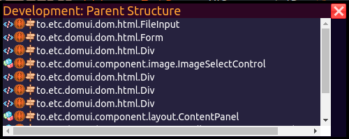
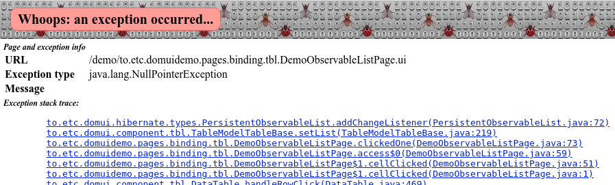
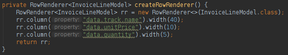
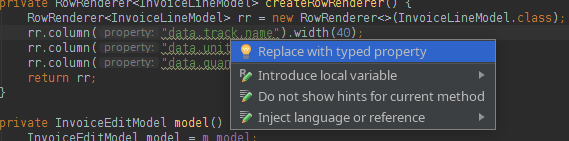
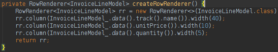

---
menu:
  sort: "40"
---
# Using the DomUI IntelliJ plugin

The IntelliJ plugin helps with coding and debugging DomUI code from within the IntelliJ Idea environment. It is a work in progress, currently in beta.

# Installing the plugin

To install the plugin do the following:

- Start your copy of IntelliJ IDEA
- Go to File → settings, then click "Plugins' in the left tab panel
- In the search bar type "DomUI". This should give you the plugin in the result list.
- Click the plugin in the list, and press "Install" to install it.
- Make sure that IntelliJ is restarted by clicking the "restart" button in the dialog box that IntelliJ puts up. If you do not see that box close the settings window.

After a restart you should see an extra option in the "Refactor" menu called "Replace Property strings with typed references" provided you are inside a Java file.

# Source code

The source for the plugin [can be found on Github](https://github.com/fjalvingh/domui-intellij-plugin).

# Using the plugin

## Plugin functions for running DomUI applications

### Using the DomUI debug panel

Any DomUI application that was started through IntelliJ can show the code for screens and components inside IntelliJ on request. To do this, move the mouse to the component on the DomUI screen you want to inspect and press the tilde quickly twice:

By clicking the icons you can either open the component's source code or you can open the location where that component was *created*. After the click the location opens in IntelliJ at the correct spot.

This helps with "decoding" DomUI screens and makes it easy to find how screens are constructed – and where.

### Error message links

Some DomUI errors will show a location trace when something goes wrong, for example:

Clicking the stack trace elements will open the relevant file at the correct location inside the IDE.

## Source code help

### Replacing string referring to JavaBean properties with DomUI typed references

Since DomUI 2.0 all code in DomUI that earlier accepted property paths as strings [now also accept typed properties](../../building-pages/40-typed-properties/index.md). Using typed properties instead of string constants has many advantages, the most important are:

- Compile-time safety: since the typed properties are maintained automatically, deleting or renaming properties will cause compile time errors. This is way better than having random runtime errors only on those places that you visit within the application.
- Type safety: a DomUI typed property encapsulates not just the name but also the type of the property that you are accessing. By using them the compiler will check that you are using the property according to its type and will report an error otherwise. 
- Because the types are known it becomes way easier to work with lambda's and helper classes inside DomUI code, as all of the helpers now "automagically" know the actual type being handled. This means casting is no longer needed, making code easier to read and less prone to errors.

The plugin helps by showing you places where property strings can be replaced by typed references, for example:

The underlined strings are property paths on InvoiceLineModel that can be replaced by typed properties. To do that the plugin adds a quick fix that is shown when you press ALT+ENTER on one of the underlined properties:

After selecting the quick fix the code will change to:

All properties in the file eligible for replacement will be changed.

In addition to changing the strings to typed references the plugin will also add the necessary @GeneratedProperties annotation on any of the data classes that are referenced by the property strings, so that the Annotation Processor will generate the required classes.

Instead of a quick fix you can also use the menu item Refactor → 

 menu option.
