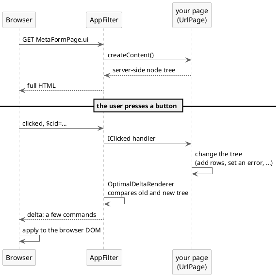
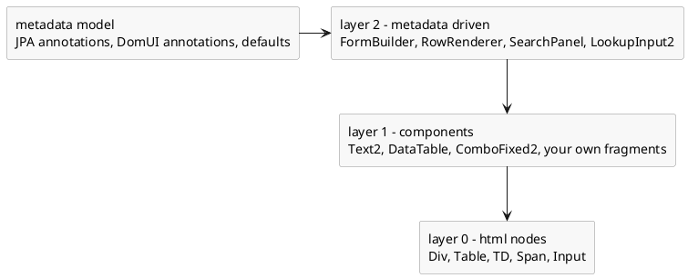

---
menu:
  sort: "20"
---
# Developer view of DomUI

A list of facts about DomUI: what it is written in, what it runs on, how a page
gets to the browser, and what the code you write looks like.

[TOC]

## The stack

- DomUI is written in Java and builds on **Java 21**.
- It runs in a **Jakarta EE servlet container** (`jakarta.servlet`): the demo
  application runs under Jetty 11 from Maven and under Tomcat 11 in production.
- The build is Maven, and it compiles with the **Eclipse batch compiler (ecj)**
  rather than javac, because DomUI uses ecj's null analysis (see
  [ecj in Maven](../../development-environment/ecj-in-maven/index.md)).
- **Hibernate 7.2** is supported out of the box, and plain JDBC is too.
- Kotlin can be used alongside Java; the framework itself is almost entirely Java.
- The browser side is small: TypeScript compiled to Javascript, scss (sass) for
  the styling, and **jQuery 3.7.1** as the backing Javascript library.
- It supports all standard modern browsers.
- A set of base libraries with common Java functionality is part of DomUI, so the
  framework does not drag in a large dependency tree.

## Screen manipulation: DomUI's DOM

A DomUI page builds a browser-like DOM **on the server**, as a tree of Java
objects, and manipulates that tree to form the UI. The first request renders that
tree as normal HTML. Every request after it renders only what changed:



- The delta is a set of commands that bring the browser's DOM in line with the
  server's, and nothing more. Deleting 1000 rows of a 1001 row table does not
  send 1000 deletes: it sends one delete for the parent and one add for the row
  that remains.
- Because the delta is small, updating a page uses hardly any bandwidth.
- Calculating it is cheap as well. `OptimalDeltaRenderer` does not diff the DOM
  blindly; the tree records what changed while your code was changing it.
- Because all of this happens in Java, on the server, the UI code can talk
  directly to whatever Java code is present. There are no DTOs and no web service
  layer between the screen and the data.

That last point is the large difference with Javascript-based UIs. A web service
layer hides field types, and even the presence and names of fields. In DomUI,
a change to the model is either fully refactorable by your IDE, or causes a compile 
time error rather than odd behavior at runtime.

## Building an application

A DomUI application is a webapp: a `web.xml` declaring one DomUI filter, plus Java
classes.

```xml
<filter>
  <filter-name>DomFilter</filter-name>
  <filter-class>to.etc.domui.server.AppFilter</filter-class>
  <init-param>
    <param-name>application</param-name>
    <param-value>to.etc.domuidemo.Application</param-value>
  </init-param>
</filter>
<filter-mapping>
  <filter-name>DomFilter</filter-name>
  <url-pattern>/*</url-pattern>
</filter-mapping>
```

- `AppFilter` must be mapped to **all** URLs; it decides per request whether the
  URL is a DomUI page, a part, a resource, or something the webapp handles itself.
- The `application` parameter names your `DomApplication` subclass. It is the
  application level singleton: it initializes the application and its
  `getRootPage()` defines the page the root URL shows.
- A page is a class extending `UrlPage` which builds its tree in `createContent()`.
- The URL of a page is the full name of its class plus the extension `.ui` -
  `/demo/to.etc.domuidemo.pages.tutorial.meta.MetaFormPage.ui` - which the
  `extension` init-param can change. A page can also be given a URL of its own
  with `@UIPage("/track/{id}")`.
- Page parameters are URL parameters: they arrive as `PageParameters`, and fields
  annotated with `@UIUrlParameter` are filled from them automatically.
- Access control is per page, by annotation: `@UIRights("admin")` on a page class
  means a user needs at least one of the named rights to open it. A user who is
  not logged in gets a `NotLoggedInException`, which the login handler turns into
  a login screen.

## Layering

DomUI is layered, and each layer is written in terms of the one below it.



**Layer 0** is the core HTML layer, `to.etc.domui.dom.html`: one class per HTML
element - `Div`, `Table`, `TD`. A node is either a `NodeBase` or, when it can have
children, a `NodeContainer` (which extends `NodeBase`). These base classes carry
all common behavior and all CSS handling: CSS properties are exposed as Java
properties and can be changed at runtime, which is how components get their
dynamic behavior. Layer 0 nodes have no extra functionality; they are as close to
the HTML elements as possible, and they are the building blocks for everything
above.

**Layer 1** is the component layer: components built out of layer 0 nodes, which
add behavior. All input components are strongly typed and return their value in
the appropriate Java type - `Text2<T>` wraps an `<input type="text">`, so a
`Text2<Integer>` returns an `Integer` from `getValue()` (or `null` when empty).
That makes conversion and field level validation the job of the control itself,
using the converter and validator frameworks. A screen fragment you write
yourself is a component like any other, which is why building complex screens out
of components is easy and keeps them maintainable.

**Layer 2** is driven by [metadata](../../building-pages/80-metadata/index.md):
builders and renderers that are told *which property* to show and work the rest
out. `FormBuilder` creates input forms, `RowRenderer` fills a `DataTable`'s
columns, `SearchPanel` builds a search form, `LookupInput2` looks up a record.
They take their labels, lengths, conversions and mandatoriness from the metadata
model of your data classes, so the same knowledge is not repeated per screen. A
builder is not part of the UI it creates: it creates layer 1 components and hands
them to your page.

## The Java "interface"

- DomUI components prefer **configuration over extension**: instead of extending a
  DomUI class you call setters on it. Programmatic configuration is what makes
  metadata driven code possible - you cannot extend a class from code, but you can
  configure one.
- It uses **configuration by exception**: components behave sensibly and are fully
  styled without being told anything.
- Generics are used wherever they help, annotations where they are clearer.
- Most of DomUI is annotated with `@NonNull` and `@Nullable` and is compiled with
  the [Eclipse batch compiler](https://help.eclipse.org/latest/topic/org.eclipse.jdt.doc.user/tasks/task-using_batch_compiler.htm),
  so [null constraints are checked at compile time](https://help.eclipse.org/latest/topic/org.eclipse.jdt.doc.user/tasks/task-using_null_annotations.htm).
- Because Java has no properties, DomUI generates
  [typed properties](../../building-pages/40-typed-properties/index.md): classes
  generated by an annotation processor holding every property of a data class and
  its type. Renaming a property then breaks the build instead of the screen, and
  because the properties carry their type most casts disappear.
- The metadata layer uses everything it can find - JPA and Hibernate annotations,
  DomUI's own annotations, and defaults - to decide how to show and handle data,
  and can be extended with your own sources.

## State management

- DomUI pages are **stateful**: the page and the data it loaded stay in memory on
  the server between requests.
- That means no serialization, no detached objects, and no reloading of data on
  every request. Forms survive any number of round trips: on return everything is
  where it was.
- Each browser tab gets its own **window session**, and within it a page has a
  **conversation**. Both are identified by the `$cid` parameter on the page URL,
  which holds the window id (a generated id, one per tab) and the conversation
  number within it: `$cid=<window id>.2`. Tabs and windows are therefore largely
  independent of each other.
- The servlet session is still used underneath, so the browser must accept the
  session cookie for DomUI to work.
- Creating a "hybrid" application - DomUI pages next to JSP or other AJAX pages -
  is not hard, but it does require understanding this state management, because
  the integration has to make sure DomUI pages are released from memory as soon as
  they are no longer needed.

## Accessing data

- DomUI has an [abstract and generic query interface](../../data/qcriteria/index.md),
  loosely modeled on Hibernate's Criteria but without its design flaws. Components
  that help define queries therefore never need hand-built SQL.
- It is Java-centric and uses the
  [typed properties](../../building-pages/40-typed-properties/index.md) to make
  queries type-safe.
- The same `QCriteria` runs against Hibernate, against plain JDBC, and - through
  `MetaManager.query(collection, criteria)` - against a collection of objects in
  memory. Other backends can be added.
- Together with the component model this abstraction makes SQL injection
  impossible when used properly. It also absorbs library changes: the large
  changes between Hibernate versions needed work inside DomUI, and almost none in
  the applications using it.
- Because a page keeps everything it loaded, edit forms are simple: no models, no
  reloading, no serialization. The other side of that coin is that a form loading
  a great deal of data keeps it all for as long as the page lives.

## Testing

- Pages are tested end to end with Selenium, from JUnit. Tests extend
  `AbstractWebDriverTest` (a clean state per test) or
  `AbstractSinglePageWebDriverTest`, and get their driver from
  `WebDriverConnector`; see [JUnit testing](../../testing/junit-testing/index.md).
- Tests do not poke at HTML. They drive **page objects**: proxies like `CpText2`,
  `CpDataTable` and `CpButton` that expose a control the way the Java control
  exposes it, so a test says "type this in the name field" rather than "find this
  `<input>`".
- Those proxies do not have to be written by hand. With the application running
  in development mode on a developer workstation, pressing `ctrl-shift-~` twice in
  quick succession on a page runs the `PageObjectGenerator` over it: it walks the
  built tree, generates a page object class per page and fragment, shows the
  generated code in a dialog and writes the files to `pageobjects` in the temp
  directory.

! The same key without `ctrl` - `shift-~` twice - is the other development mode
! helper: it shows the chain of parent nodes above the node under the mouse, which
! is how you find out which component built a given spot on the screen.
