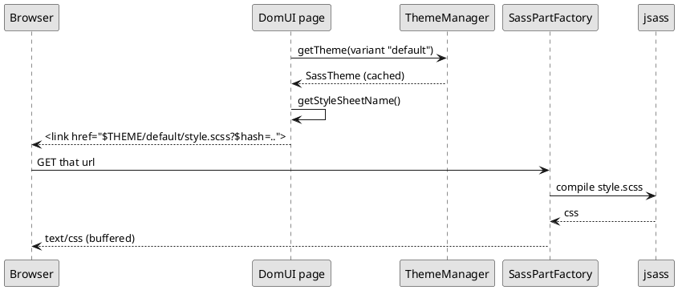

---
menu:
  sort: "10"
---
# Themes

A theme is a directory of SCSS with a `style.scss` in it. DomUI ships one,
`winter`. An application has exactly **one** theme, and it is chosen once, during
initialization, by handing `DomApplication` the factory that builds it:

```java
setThemeFactory(SassThemeFactory.INSTANCE);
```

That is all most applications ever do with themes. It cannot be changed
afterwards, and there is no way to have two themes in play at the same time.

What *can* differ from session to session is the theme's **variant** - which is
how a dark and a light version of the same theme are done.

[TOC]

## Variants

A variant is a name, and nothing more:

```java
static public final IThemeVariant DARK = IThemeVariant.of("dark");
```

Set it on the request context and it holds for the rest of the session, so a
choice made on one page carries to every page after it:

```java
UIContext.getRequestContext().setThemeVariant(DARK);
```

To decide the variant per user instead - from a stored preference, say - override
`calculateUserThemeVariant()` in your `DomApplication`. It is asked once per
session, when the session has not set a variant of its own:

```java
@Override
public IThemeVariant calculateUserThemeVariant(IRequestContext ctx) {
	return userPrefersDark(ctx) ? DARK : super.calculateUserThemeVariant(ctx);
}
```

Sessions that never choose get `default`.

## Where a theme file comes from

The style and the variant become a **search path**, tried in order until a file
is found:

| Order | Path | Present when |
| --- | --- | --- |
| 1 | `$themes/scss/<style>/<variant>` | the variant is not `default` |
| 2 | `$themes/scss/<style>` | always |
| 3 | `$themes/scss/all` | always |

Because the first directory that has a file wins, a variant overrides exactly
what it wants to and inherits the rest. That makes a dark theme a directory:

```
themes/scss/winter/dark/_color.scss
```

`style.scss` keeps its plain `@import 'color'`; under the `dark` variant that
import finds `dark/_color.scss`, under `default` it finds the theme's own. The
same works for an image - a `dark/btnCancel.png` is served only to sessions
rendering in `dark`, and every image the variant does not replace still comes
from `winter`.

If you would rather branch inside one file than keep a directory per variant, the
variant name is also handed to the stylesheet as a variable:

```scss
@if $themeVariant == "dark" {
	$background-color: #101014;
}
```

The `$` on the front of `$themes` makes DomUI's resource resolver handle the
name, and it looks in four places, **in this order**:

1. a file in the webapp directory - `<webapp>/themes/scss/winter/style.scss`
2. in development mode, `META-INF/resources/themes/...` on the classpath,
   reloaded when it changes
3. a resource served by the servlet container
4. the classpath, under `/resources/` - which is where DomUI's own theme lives

An application file therefore **wins over the framework's**, and that is the
hook the whole of [overriding the theme](../overriding-the-theme/index.md)
hangs on.

## How the stylesheet reaches the browser



Every themed URL carries the variant as its first segment - `$THEME/default/...`,
`$THEME/dark/...` - so the variant decides which file is served, and two variants
never share a cache entry.

Nothing is compiled ahead of time and nothing is written to disk. The page emits
a `$THEME/`-prefixed link whose query string carries a hash of the compiled
result, so the URL changes whenever the stylesheet does and the browser cache
never has to be reasoned about.

`ThemeManager` keeps the built `ITheme` objects in a map keyed by variant name.
It tracks the resources each was built from, so a changed file invalidates the
entry rather than being served stale.
