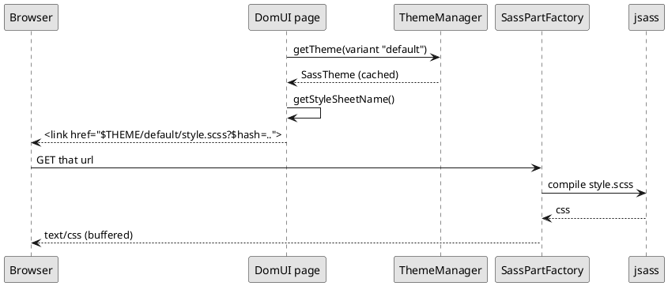

---
menu:
  sort: "10"
---
# Themes

A theme is a directory of SCSS with a `style.scss` in it. DomUI ships one,
`winter`. An application has exactly **one** theme, and it is chosen once, during
initialization, by handing `DomApplication` the factory that builds it:

```java
setThemeFactory(SassThemeFactory.INSTANCE);
```

That is all most applications ever do with themes. It cannot be changed
afterwards, and there is no way to have two themes in play at the same time.

What *can* differ from session to session is the theme's **variant** - which is
how a dark and a light version of the same theme are done.

[TOC]

## Variants

A variant is a name, and nothing more. DomUI ships one of its own - `dark`, a dark
version of the winter theme - as `DarkThemeVariant.INSTANCE`; declare your own the
same way:

```java
static public final IThemeVariant HIGH_CONTRAST = IThemeVariant.of("high-contrast");
```

Set it on the request context and it holds for the rest of the session, so a
choice made on one page carries to every page after it:

```java
UIContext.getRequestContext().setThemeVariant(DarkThemeVariant.INSTANCE);
```

The stylesheet link is written by the *full* page renderer, so after switching the
page has to be reloaded for the new sheet to arrive. The demo does that with
`appendJavascript("WebUI.refreshPage();")`, which keeps the conversation and so
keeps whatever the user had typed:

!demo(to.etc.domuidemo.pages.HomePage.ui)

The sun/moon button at the top right of every demo page is the whole of it - see
`ThemeVariantSwitch` in the demo source.

To decide the variant per user instead - from a stored preference, say - override
`calculateUserThemeVariant()` in your `DomApplication`. It is asked once per
session, when the session has not set a variant of its own:

```java
@Override
public IThemeVariant calculateUserThemeVariant(IRequestContext ctx) {
	return userPrefersDark(ctx) ? DarkThemeVariant.INSTANCE : super.calculateUserThemeVariant(ctx);
}
```

Sessions that never choose get `default`.

## Where a theme file comes from

The style and the variant become a **search path**, tried in order until a file
is found:

| Order | Path | Present when |
| --- | --- | --- |
| 1 | `$themes/scss/<style>/<variant>` | the variant is not `default` |
| 2 | `$themes/scss/<style>` | always |
| 3 | `$themes/scss/all` | always |

Because the first directory that has a file wins, a variant overrides exactly
what it wants to and inherits the rest. That is how the shipped dark variant is
built - **one file**, and no rule of the theme repeated anywhere:

```
themes/scss/winter/dark/_color.scss
```

`style.scss` keeps its plain `@import 'color'`; under the `dark` variant that
import finds `dark/_color.scss`, under `default` it finds the theme's own. The
same works for an image - a `dark/btnCancel.png` is served only to sessions
rendering in `dark`, and every image the variant does not replace still comes
from `winter`.

That one file is enough because `_color.scss` is imported *before*
`_variables.scss` and everything in that file carries `!default`: set a variable
there and it wins, and `_derived-variables.scss` recomputes text, background,
border, link and input colours from it. The dark one mostly turns the greyscale
ramp upside down - `$white` becomes the darkest surface, `$grey-darker` the
lightest text - so every rule that reaches for "the light end of the ramp" gets a
dark colour without knowing it.

For that to work a rule has to *have* a variable to take its colour from. The
theme names the ones a variant is most likely to want:

| Variable | Used for |
| --- | --- |
| `$bg_color`, `$body-color` | the page itself |
| `$line-color` | every line that is not part of a control: the edge of a panel, window, pane or menu, and rules between table cells |
| `$surface-bg`, `$surface-color` | panels, popups, menus, layout panes |
| `$surface-alt-bg` | a band or a second step up from a surface |
| `$input-bg`, `$input-color`, `$input-ro-bg-top`/`-bottom` | input controls |
| `$border`, `$border-hover` | the border of a control - these come from the greyscale ramp, so they follow a variant already |
| `$row-hover-bg`, `$row-hover-outline` | the hover wash on a table row |
| `$cal-*` | the jscalendar popup (`_calendarTheme.scss`) |

A partial that still writes a colour literally cannot be redressed by a variant -
so when you find one, give it a variable here rather than overriding it in the
variant. An application stylesheet, which the theme has no variables for, can
branch on `$themeVariant` instead: that is what the demo does in
`css/_darkstyle.scss` for its own colours.

The `$` on the front of `$themes` makes DomUI's resource resolver handle the
name, and it looks in four places, **in this order**:

1. a file in the webapp directory - `<webapp>/themes/scss/winter/style.scss`
2. in development mode, `META-INF/resources/themes/...` on the classpath,
   reloaded when it changes
3. a resource served by the servlet container
4. the classpath, under `/resources/` - which is where DomUI's own theme lives

An application file therefore **wins over the framework's**, and that is the
hook the whole of [overriding the theme](../overriding-the-theme/index.md)
hangs on.

## How the stylesheet reaches the browser



Every themed URL carries the variant as its first segment - `$THEME/default/...`,
`$THEME/dark/...` - so the variant decides which file is served, and two variants
never share a cache entry.

Nothing is compiled ahead of time and nothing is written to disk. The page emits
a `$THEME/`-prefixed link whose query string carries a hash of the compiled
result, so the URL changes whenever the stylesheet does and the browser cache
never has to be reasoned about.

`ThemeManager` keeps the built `ITheme` objects in a map keyed by variant name.
It tracks the resources each was built from, so a changed file invalidates the
entry rather than being served stale.
