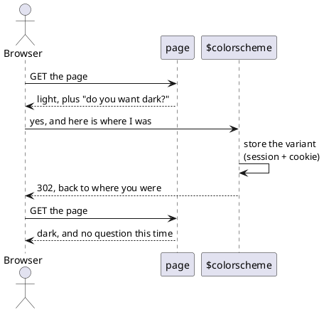
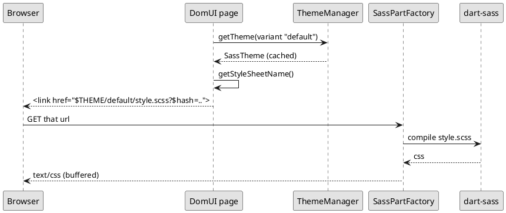

---
menu:
  sort: "10"
---
# Themes

A theme is a directory of SCSS with a `style.scss` in it. DomUI ships one,
`winter`. An application has exactly **one** theme, and it is chosen once, during
initialization, by handing `DomApplication` the factory that builds it:

```java
setThemeFactory(SassThemeFactory.INSTANCE);
```

That is all most applications ever do with themes. It cannot be changed
afterwards, and there is no way to have two themes in play at the same time.

What *can* differ from session to session is the theme's **variant** - which is
how a dark and a light version of the same theme are done.

[TOC]

## Variants

A variant is a name, and nothing more. DomUI ships one of its own - `dark`, a dark
version of the winter theme - as `DarkThemeVariant.INSTANCE`; declare your own the
same way:

```java
static public final IThemeVariant HIGH_CONTRAST = IThemeVariant.of("high-contrast");
```

Set it on the request context and it holds for the rest of the session - and for
the sessions after it, because the choice goes into a cookie as well:

```java
UIContext.getRequestContext().setThemeVariant(DarkThemeVariant.INSTANCE);
```

The stylesheet link is written by the *full* page renderer, so after switching the
page has to be reloaded for the new sheet to arrive. The demo does that with
`appendJavascript("WebUI.refreshPage();")`, which keeps the conversation and so
keeps whatever the user had typed:

!demo(to.etc.domuidemo.pages.HomePage.ui)

The sun/moon button at the top right of every demo page is the whole of it - see
`ThemeVariantSwitch` in the demo source. Press it, close the browser, come back:
the page is still the way you left it.

## The first visit

A user who has not chosen anything yet gets the scheme their desktop is set to.
The preference lives in the browser and the theme is a server side stylesheet, so
DomUI asks for it in the one place where the two meet - a script at the top of the
page head, before the stylesheet the browser is about to fetch:



Because the script leaves before the stylesheet is fetched, nothing has been
painted yet: the user sees the page they wanted, not a flash of the other one.

The question is only put to a browser that has nothing stored, so it is asked once
and then never again - and pressing the switch answers it too. What each answer
means is `getThemeVariantForColorScheme()` in your `DomApplication`; returning
`null` from it stops the question being asked at all, which is what a theme with no
dark variant of its own must do:

```java
@Override
public IThemeVariant getThemeVariantForColorScheme(String colorScheme) {
	return null;
}
```

To decide the variant per user instead - from a preference stored with the account,
say - override `calculateUserThemeVariant()` in your `DomApplication`. It is asked
when neither the session nor the cookie holds a choice, so switch the browser
question off as well or it will overrule what you return:

```java
@Override
public IThemeVariant calculateUserThemeVariant(IRequestContext ctx) {
	return userPrefersDark(ctx) ? DarkThemeVariant.INSTANCE : super.calculateUserThemeVariant(ctx);
}
```

Sessions that get through all of that without a variant render in `default`.

## Where a theme file comes from

The style and the variant become a **search path**, tried in order until a file
is found:

| Order | Path | Present when |
| --- | --- | --- |
| 1 | `$themes/scss/<style>/<variant>` | the variant is not `default` |
| 2 | `$themes/scss/<style>` | always |
| 3 | `$themes/scss/all` | always |

Because the first directory that has a file wins, a variant overrides exactly
what it wants to and inherits the rest. That is how the shipped dark variant is
built - **one file**, and no rule of the theme repeated anywhere:

```
themes/scss/winter/dark/_color.scss
```

The theme loads its variables through `color`; under the `dark` variant that
name finds `dark/_color.scss`, under `default` it finds the theme's own. The
same works for an image - a `dark/btnCancel.png` is served only to sessions
rendering in `dark`, and every image the variant does not replace still comes
from `winter`.

That one file is enough because `_color.scss` is where the theme's two variable
modules are loaded, and a module's `!default` variables can be given their
values by whoever loads them. The variant's file loads them *with* its own
values:

```scss
@forward "variables" with (
	$white:        hsl(220, 13%, 11%) !default,		// page background
	$grey-darker:  hsl(220, 14%, 88%) !default,		// $text-strong, input text
	...
);
@use "variables" as v;
@forward "derived-variables" with (
	$pmnu-bg: v.$white-ter !default,
	...
);
```

and `_derived-variables.scss` recomputes text, background, border, link and
input colours from what `_variables.scss` was given. The `!default` on each
value is what lets an application's `_custominit.scss` still win over the
variant. The dark one mostly turns the greyscale ramp upside down - `$white`
becomes the darkest surface, `$grey-darker` the lightest text - so every rule
that reaches for "the light end of the ramp" gets a dark colour without knowing
it.

For that to work a rule has to *have* a variable to take its colour from. The
theme names the ones a variant is most likely to want:

| Variable | Used for |
| --- | --- |
| `$body-bg`, `$body-color` | the page itself |
| `$grey-ramp`, `ladder()` | anything that nests - see below |
| `$line-color` | every line that is not part of a control: the edge of a panel, window, pane or menu, and rules between table cells |
| `$surface-bg`, `$surface-color` | panels, popups, menus, layout panes |
| `$surface-alt-bg` | a band or a second step up from a surface |
| `$input-bg`, `$input-color`, `$input-ro-bg-top`/`-bottom` | input controls |
| `$border`, `$border-hover` | the border of a control - these come from the greyscale ramp, so they follow a variant already |
| `$row-hover-bg`, `$row-hover-outline` | the hover wash on a table row |
| `$cal-*` | the jscalendar popup (`_calendarTheme.scss`) |

### Where a colour is named

Colours live in two tiers, and a component reads only the second.

The **main set** is in `_variables.scss`. Its names say what a colour is in the theme's
own vocabulary and never mention a component - `$primary`, `$line-color`, `$surface-bg`,
`$input-bg`, the `$errors-*` / `$warnings-*` / `$info-*` states, the `$black`..`$white`
greyscale ramp.

**Component colours** are in `_derived-variables.scss`: one variable per colour a
component paints, each defaulting to a main-set value.

```scss
//-- LogTailer (.ui-tlf-*)
$tlf-hdr-bg: $primary !default;
```

The component's own stylesheet then reads only its own variables - never a literal, and
never a main-set value directly:

```scss
.ui-tlf-hdr {
	background-color: $tlf-hdr-bg;
}
```

That indirection is the point. An application can restyle one component by setting one
variable, a variant can move the whole theme by setting the main set, and neither has to
edit a component.

Both tiers name variables the same way, in kebab-case:

```
$<component>-<part>-<role>
```

| | |
| --- | --- |
| `<component>` | the component's CSS class prefix with `ui-` removed - `tlf` for `.ui-tlf-*`, `pmnu` for `.ui-pmnu-*`. The main set omits it. |
| `<part>` | the element inside it, where a component paints more than one thing: `hdr`, `title`, `item`. Omitted where it paints one. |
| `<role>` | what the colour does, and the part that must not vary: `-bg`, `-color` (text - the word CSS itself uses, never a background), `-border`, `-outline`, `-shadow`. |

! Underscores and hyphens are the same character to SCSS: `$link-color` and `$link-color`
! are one variable. An application that sets a theme variable by its old `snake_case`
! spelling therefore still sets the current one, and the rename that brought the theme's
! last 79 such names into line changed not one byte of the compiled stylesheet.

### Things that nest

A component whose levels nest - a submenu inside a submenu, a tree inside a tree -
should not hand-pick a grey per level. `$grey-ramp` is the theme's greyscale as an
ordered list, and `ladder()` walks it:

```scss
$pmnu-bg: $grey-darker !default;			// the component's own rung

.ui-pmnu     { background-color: ladder($pmnu-bg);    }
.ui-pmnu-sm1 { background-color: ladder($pmnu-bg, 1); }		// one level in
.ui-pmnu-sm2 { background-color: ladder($pmnu-bg, 2); }		// two levels in
```

A negative level walks the other way, for something that sits *under* the component's
own surface - a title band, a border. Walking off either end of the ramp clamps rather
than failing.

Two things this buys. The steps stay even and stay distinct: the popup menu used to
pick `#666` and `#888` for its middle two levels, close enough that rounding each to
its nearest ramp step would have collapsed them into one colour. And a variant only
sets the base - `$ladder-direction` inverts with the ramp, so a ladder keeps stepping
*away from the page ground* in either variant. The dark variant's whole entry for the
popup menu is two lines:

```scss
$ladder-direction: -1 !default,		// the ramp is inverted, so ladders walk it the other way
$pmnu-bg: v.$white-ter !default,	// a raised dark surface instead of an inverted one
```

A partial that still writes a colour literally cannot be redressed by a variant -
so when you find one, give it a variable here rather than overriding it in the
variant. An application stylesheet, which the theme has no variables for, can
branch on the variant's name instead: that is what the demo does in
`css/_darkstyle.scss` for its own colours, reading `p.$themeVariant` from the
[parameters module](../sass-scss-support/index.md).

The `$` on the front of `$themes` makes DomUI's resource resolver handle the
name, and it looks in four places, **in this order**:

1. a file in the webapp directory - `<webapp>/themes/scss/winter/style.scss`
2. in development mode, `META-INF/resources/themes/...` on the classpath,
   reloaded when it changes
3. a resource served by the servlet container
4. the classpath, under `/resources/` - which is where DomUI's own theme lives

An application file therefore **wins over the framework's**, and that is the
hook the whole of [overriding the theme](../overriding-the-theme/index.md)
hangs on.

## How the stylesheet reaches the browser



Every themed URL carries the variant as its first segment - `$THEME/default/...`,
`$THEME/dark/...` - so the variant decides which file is served, and two variants
never share a cache entry.

Nothing is compiled ahead of time and nothing is written to disk. The page emits
a `$THEME/`-prefixed link whose query string carries a hash of the compiled
result, so the URL changes whenever the stylesheet does and the browser cache
never has to be reasoned about.

`ThemeManager` keeps the built `ITheme` objects in a map keyed by variant name.
It tracks the resources each was built from, so a changed file invalidates the
entry rather than being served stale.
