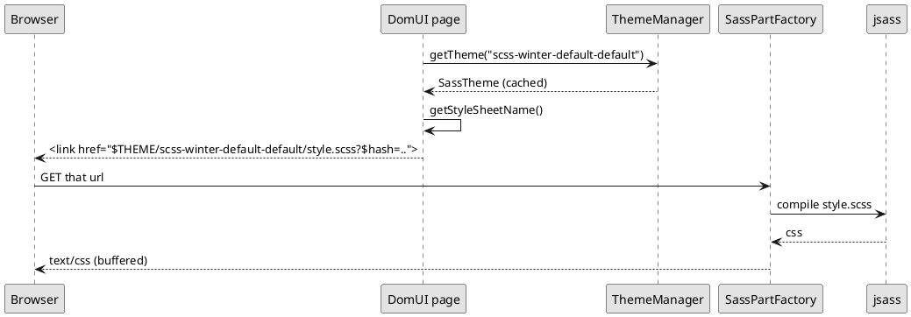

---
menu:
  sort: "10"
---
# Themes

A theme is a directory of SCSS with a `style.scss` in it. DomUI ships one,
`winter`, and an application uses it unless it says otherwise. The application
default is set once, in `DomApplication`:

```java
setDefaultThemeFactory(SassThemeFactory.INSTANCE);
```

That is all most applications ever do with themes: the factory names its own
default theme, and every page from then on is rendered against it.

[TOC]

## The theme name

A theme is identified by a string with four or five dash-separated parts:

```
factory-style-icon-color-variant
```

The default the factory hands out is:

```
scss-winter-default-default
```

| Part | In the default | What it selects |
| --- | --- | --- |
| factory | `scss` | which `IThemeFactory` builds the theme |
| style | `winter` | the directory under `$themes/scss/` holding `style.scss` |
| icon | `default` | an icon-set directory searched before the style's own |
| color | `default` | a colour-set directory searched before the style's own |
| variant | absent | a variant name; see below |

`DomApplication.setDefaultThemeName()` takes such a string, and
`getDefaultThemeName()` gives back the one in force. The factory part is what
picks the factory: `DomApplication.getFactoryFromThemeName()` looks the leading
word up in the registry that `register(IThemeFactory)` fills.

!! The **variant** is parsed and then ignored. `SassThemeFactory` reads the
!! fifth part into a local variable and builds the `SassTheme` without it, so
!! `UrlPage.setThemeVariant()` and a fifth part in the theme name change
!! nothing. It is a leftover from the stylesheet system that came before this
!! one. Do not use it.

## Where a theme file comes from

The style, icon and colour parts become a **search path**, tried in order until
a file is found:

| Order | Path | Present when |
| --- | --- | --- |
| 1 | `$themes/scss/<style>/<color>-color` | the colour part is not `default` |
| 2 | `$themes/scss/<style>/<icon>-icons` | the icon part is not `default` |
| 3 | `$themes/scss/<style>` | always |
| 4 | `$themes/scss/all` | always |

With the default name only the last two entries exist, so everything resolves
to `$themes/scss/winter` - which is why `winter` and "the theme" are usually
the same thing in practice.

The `$` on the front makes DomUI's resource resolver handle the name, and it
looks in four places, **in this order**:

1. a file in the webapp directory - `<webapp>/themes/scss/winter/style.scss`
2. in development mode, `META-INF/resources/themes/...` on the classpath,
   reloaded when it changes
3. a resource served by the servlet container
4. the classpath, under `/resources/` - which is where DomUI's own theme lives

An application file therefore **wins over the framework's**, and that is the
hook the whole of [overriding the theme](../overriding-the-theme/index.md)
hangs on.

## How the stylesheet reaches the browser



Nothing is compiled ahead of time and nothing is written to disk. The page emits
a `$THEME/`-prefixed link whose query string carries a hash of the compiled
result, so the URL changes whenever the stylesheet does and the browser cache
never has to be reasoned about.

`ThemeManager` keeps the built `ITheme` objects in a map keyed by theme name and
drops one that has not been used for five minutes. It also tracks the resources
the theme was built from, so a changed file invalidates the entry rather than
being served stale.
