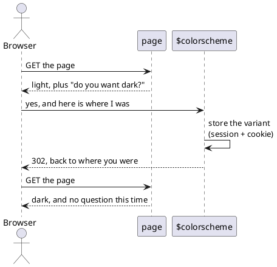
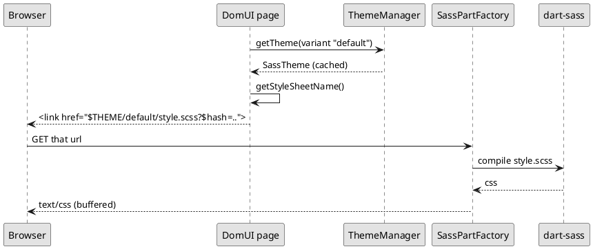

---
menu:
  sort: "10"
---
# Themes

A theme is a directory of SCSS with a `style.scss` in it. DomUI ships one,
`winter`. An application has exactly **one** theme, and it is chosen once, during
initialization, by handing `DomApplication` the factory that builds it:

```java
setThemeFactory(SassThemeFactory.INSTANCE);
```

That is all most applications ever do with themes. It cannot be changed
afterwards, and there is no way to have two themes in play at the same time.

What *can* differ from session to session is the theme's **variant** - which is
how a dark and a light version of the same theme are done.

[TOC]

## Variants

A variant is a name, and nothing more. DomUI ships one of its own - `dark`, a dark
version of the winter theme - as `DarkThemeVariant.INSTANCE`; declare your own the
same way:

```java
static public final IThemeVariant HIGH_CONTRAST = IThemeVariant.of("high-contrast");
```

Set it on the request context and it holds for the rest of the session:

```java
UIContext.getRequestContext().setThemeVariant(DarkThemeVariant.INSTANCE);
```

The stylesheet link is written by the *full* page renderer, so after switching the
page has to be reloaded for the new sheet to arrive. The demo does that with
`appendJavascript("WebUI.refreshPage();")`, which keeps the conversation and so
keeps whatever the user had typed:

!demo(to.etc.domuidemo.pages.HomePage.ui)

The sun/moon button at the top right of every demo page is the whole of it - see
`ThemeVariantSwitch` in the demo source.

To keep the choice for the sessions after this one too, name a cookie for it in
your `DomApplication.initialize()`:

```java
setThemeVariantCookieName("myapp-theme-variant");
```

Now press the switch, close the browser, come back: the page is still the way you
left it. The name is yours to choose, and there is no default, because every
application on a host would otherwise read the same cookie and a choice made in
one would carry into all the others. Without a name there is no cookie: the choice
lasts as long as the session, and the browser is not asked for its preference
either (see below), because the answer could not be kept.

## The first visit

A user who has not chosen anything yet gets the scheme their desktop is set to.
The preference lives in the browser and the theme is a server side stylesheet, so
DomUI asks for it in the one place where the two meet - a script at the top of the
page head, before the stylesheet the browser is about to fetch:


```plantuml
@startuml
skinparam shadowing false
actor Browser
participant "page" as Page
participant "$colorscheme" as Part

Browser -> Page: GET the page
Page --> Browser: light, plus "do you want dark?"
Browser -> Part: yes, and here is where I was
Part -> Part: store the variant\n(session + cookie)
Part --> Browser: 302, back to where you were
Browser -> Page: GET the page
Page --> Browser: dark, and no question this time
@enduml
```

Because the script leaves before the stylesheet is fetched, nothing has been
painted yet: the user sees the page they wanted, not a flash of the other one.

The question is only put to a browser that has nothing stored, so it is asked once
and then never again - and pressing the switch answers it too. It is not asked at
all by an application without a theme cookie, since it could not keep the answer.
What each answer means is `getThemeVariantForColorScheme()` in your
`DomApplication`; returning
`null` from it stops the question being asked at all, which is what a theme with no
dark variant of its own must do:

```java
@Override
public IThemeVariant getThemeVariantForColorScheme(String colorScheme) {
	return null;
}
```

To decide the variant per user instead - from a preference stored with the account,
say - override `calculateUserThemeVariant()` in your `DomApplication`. It is asked
when neither the session nor the cookie holds a choice, so switch the browser
question off as well or it will overrule what you return:

```java
@Override
public IThemeVariant calculateUserThemeVariant(IRequestContext ctx) {
	return userPrefersDark(ctx) ? DarkThemeVariant.INSTANCE : super.calculateUserThemeVariant(ctx);
}
```

Sessions that get through all of that without a variant render in `default`.

## Where a theme file comes from

The style and the variant become a **search path**, tried in order until a file
is found:

| Order | Path | Present when |
| --- | --- | --- |
| 1 | `$themes/scss/<style>/<variant>` | the variant is not `default` |
| 2 | `$themes/scss/<style>` | always |
| 3 | `$themes/scss/all` | always |

Because the first directory that has a file wins, a variant overrides exactly
what it wants to and inherits the rest. A variant replaces **the two files that hold the
theme's colours**, and the images that do not work in it - and no rule of the theme is
repeated anywhere:

```
themes/scss/winter/_palette.scss              the light theme's main set of colours
themes/scss/winter/_component-colors.scss     ...and one colour per thing a component paints
themes/scss/winter/dark/_palette.scss         the dark variant's own copy of each
themes/scss/winter/dark/_component-colors.scss
themes/scss/winter/dark/*.png, *.gif          the images that need a dark version
```

Under the `dark` variant the theme's `@forward "palette"` finds `dark/_palette.scss`,
under `default` it finds the theme's own. The same works for an image - a
`dark/btn-datein.png` is served only to sessions rendering in `dark`, for a `url()` in a
stylesheet and for a `THEME/btn-datein.png` in Java alike, and every image the variant
does not replace still comes from `winter`.

A variant's copy **replaces** the light file completely; it does not adjust it. So it
declares every variable the light file declares - one it leaves out is a compile error the
moment a stylesheet reads it - and nothing in it is computed from the light theme. Every
colour of the dark variant is a value someone chose, written in one of its two files:

```scss
// themes/scss/winter/dark/_palette.scss
$body-bg: #2B2B2B !default;              // the page: Darcula's editor ground
$surface-bg: #313335 !default;           // a panel on the page, one step up
$ground-bg: #45494A !default;            // what a control or button is filled with
$text-color: #BBBBBB !default;
$primary: #CC7832 !default;              // the accent, muted for a dark page
...
```

The dark variant DomUI ships is modelled on IntelliJ's Darcula: dark grey rather than
black, neutral greys for the grounds, a steel blue for what structures a page (caption
bars, tab strips, table headers) and Darcula's orange for what acts. Every pair of text
and ground it uses is tested for WCAG AA contrast.

The `!default` on each value is what lets an application still set it: an application's
[`_custominit.scss`](../overriding-the-theme/index.md) wins over both variants, and its
`_variant-custominit.scss` sets a value for one variant only.

For a variant to recolour something, a rule has to *have* a variable to take its colour
from. The theme names the ones a variant is most likely to want:

| Variable | Used for |
| --- | --- |
| `$body-bg`, `$body-color` | the page itself |
| `$surface-bg`, `$surface-color`, `$surface-alt-bg`, `$window-bg` | panels, a band inside one, floating windows and popups |
| `$ground-bg`, `$ground-alt-bg` | what a control or button is filled with, and a recessed or static one |
| `$text-color`, `$text-strong-color`, `$text-muted` | text at three strengths |
| `$line-soft`, `$line-color`, `$line-strong`, `$line-hard` | every line that is not part of a control, from the quietest to a frame |
| `$control-border`, `$control-hover-border`, `$control-active-border` | the edge of an input or a button |
| `$input-bg`, `$input-color`, `$input-ro-bg-top`/`-bottom` | input controls |
| `$primary`, `$link-color`, `$selected-bg`, `$highlight-bg` | the accent, links, selection |
| `$header-bg`, `$title-bg`, `$title-color` | caption bars and title bands |
| `$errors-*`, `$warnings-*`, `$info-*` | the states, each a ground, a text colour and an edge |
| `$row-hover-bg`, `$row-hover-outline` | the hover wash on a table row |
| `$dt-*`, `$tab-*`, `$cal-*`, ... | the colours of one component - see below |

The greys `$white` .. `$black` are there too, and in every variant they mean what they
say: `$white` is white. A rule that wants "a surface" or "a line" takes the role for it,
not a grey.

### Where a colour is named

Colours live in two tiers, and a component reads only the second.

The **main set** is in `_palette.scss`. Its names say what a colour is in the theme's
own vocabulary and never mention a component - `$primary`, `$line-color`, `$surface-bg`,
`$input-bg`, the `$errors-*` / `$warnings-*` / `$info-*` states, the roles above.

**Component colours** are in `_component-colors.scss`: one variable per colour a
component paints, each defaulting to a main-set value.

```scss
//-- LogTailer (.ui-tlf-*)
$tlf-hdr-bg: $primary !default;
```

The component's own stylesheet then reads only its own variables - never a literal, and
never a main-set value directly - and never computes a colour itself: a hover or a
pressed shade is a variable of its own too.

```scss
.ui-tlf-hdr {
	background-color: $tlf-hdr-bg;
}
```

That indirection is the point. An application can restyle one component by setting one
variable, a variant can map a component onto different roles than the light theme does,
and neither has to edit a component. Both files exist once per variant. The light ones
may still derive a value with `lighter()` or `findColorInvert()` where that is what the
light theme always did; a variant states every value.

Both tiers name variables the same way, in kebab-case:

```
$<component>-<part>-<role>
```

| | |
| --- | --- |
| `<component>` | the component's CSS class prefix with `ui-` removed - `tlf` for `.ui-tlf-*`, `pmnu` for `.ui-pmnu-*`. The main set omits it. |
| `<part>` | the element inside it, where a component paints more than one thing: `hdr`, `title`, `item`. Omitted where it paints one. |
| `<role>` | what the colour does, and the part that must not vary: `-bg`, `-color` (text - the word CSS itself uses, never a background), `-border`, `-outline`, `-shadow`. |

! Underscores and hyphens are the same character to SCSS: `$link_color` and `$link-color`
! are one variable. An application that sets a theme variable by its old `snake_case`
! spelling therefore still sets the current one.

Fonts, sizes and spacing are not colours, and are not per variant: they are in
`_variables.scss` and `_derived-variables.scss`, shared by all.

### Things that nest

A component whose levels nest - a submenu inside a submenu - states each level as a
variable of its own, in each variant: `$pmnu-bg`, `$pmnu-sm1-bg`, `$pmnu-sm2-bg`,
`$pmnu-sm3-bg`. In light each submenu is a step lighter grey, in dark a step lighter
panel; the variant chooses the steps, rather than walking a scale that would have to
mean something different in each.

### Images

An image that does not read on a dark page has a dark copy with the same name in
`dark/`. The copies are not drawn by hand: `buildResources/dark-theme-images.sh` in the
DomUI source makes them from the light images, turning their lightness around while
keeping their colours, so a changed image is a re-run of the script. An image that must
be there before anything can be loaded is no image at all: the sort arrows of a table
header and the spinner of the "waiting for the server" message are drawn by css, in the
variant's colours.

A partial that still writes a colour literally cannot be redressed by a variant -
so when you find one, give it a variable rather than overriding it in the variant. An
application stylesheet can read the theme's roles with `@use "theme" as t;` - which is
what the demo's `css/_darkstyle.scss` does for its own colours, inside a branch on
`p.$themeVariant` from the [parameters module](../sass-scss-support/index.md).

The `$` on the front of `$themes` makes DomUI's resource resolver handle the
name, and it looks in four places, **in this order**:

1. a file in the webapp directory - `<webapp>/themes/scss/winter/style.scss`
2. in development mode, `META-INF/resources/themes/...` on the classpath,
   reloaded when it changes
3. a resource served by the servlet container
4. the classpath, under `/resources/` - which is where DomUI's own theme lives

An application file therefore **wins over the framework's**, and that is the
hook the whole of [overriding the theme](../overriding-the-theme/index.md)
hangs on.

## How the stylesheet reaches the browser


```plantuml
@startuml
skinparam monochrome true
skinparam shadowing false
participant Browser
participant "DomUI page" as Page
participant ThemeManager
participant SassPartFactory
participant "dart-sass" as Sass

Page -> ThemeManager: getTheme(variant "default")
ThemeManager --> Page: SassTheme (cached)
Page -> Page: getStyleSheetName()
Page --> Browser: <link href="$THEME/default/style.scss?$hash=..">
Browser -> SassPartFactory: GET that url
SassPartFactory -> Sass: compile style.scss
Sass --> SassPartFactory: css
SassPartFactory --> Browser: text/css (buffered)
@enduml
```

Every themed URL carries the variant as its first segment - `$THEME/default/...`,
`$THEME/dark/...` - so the variant decides which file is served, and two variants
never share a cache entry.

Nothing is compiled ahead of time and nothing is written to disk. The page emits
a `$THEME/`-prefixed link whose query string carries a hash of the compiled
result, so the URL changes whenever the stylesheet does and the browser cache
never has to be reasoned about.

`ThemeManager` keeps the built `ITheme` objects in a map keyed by variant name.
It tracks the resources each was built from, so a changed file invalidates the
entry rather than being served stale.
