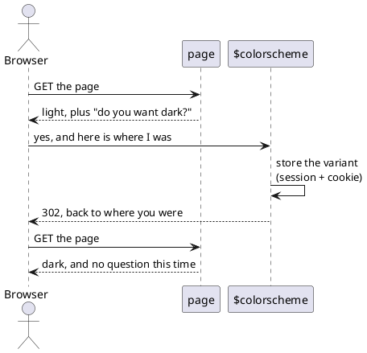
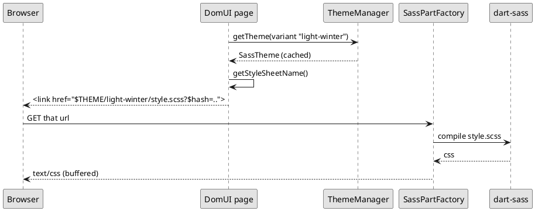

---
menu:
  sort: "10"
---
# Themes

A theme is a directory of SCSS with a `style.scss` in it. DomUI ships one,
`winter`. An application has exactly **one** theme, and it is chosen once, during
initialization, by handing `DomApplication` the factory that builds it:

```java
setThemeFactory(SassThemeFactory.INSTANCE);
```

That is all most applications ever do with themes. It cannot be changed
afterwards, and there is no way to have two themes in play at the same time.

What *can* differ from session to session is the theme's **colour scheme** - the
theme's variant. A scheme is light or dark, and the winter theme comes with six of them.

[TOC]

## Colour schemes

Every variant of the theme is a colour scheme of a **nature**, light or dark, and is
named for both: `light-winter`, `dark-nord`. The winter theme ships these, as constants
of `SchemeVariant`:

| Variant | Constant | What it looks like |
| --- | --- | --- |
| `light-winter` | `WINTER` | DomUI's light theme |
| `dark-midnight` | `MIDNIGHT` | deep indigo grounds, electric blue structure, neon accents (after Tokyo Night) |
| `dark-darcula` | `DARCULA` | neutral greys with muted colours (after IntelliJ's Darcula) |
| `dark-lagoon` | `LAGOON` | deep sea-green grounds with vivid teal structure |
| `dark-violet` | `VIOLET` | aubergine grounds, violet structure, pink and cyan accents (after Dracula) |
| `dark-nord` | `NORD` | arctic blue-grey grounds, frost blue structure: the calm one |

The theme review page in the demo shows every component in one go, in whichever scheme
you pick from the bar at its top:

!demo(to.etc.domuidemo.pages.themereview.ThemeReviewPage.ui)

Set a scheme on the request context and it holds for the rest of the session:

```java
UIContext.getRequestContext().setThemeVariant(SchemeVariant.NORD);
```

The stylesheet link is written by the *full* page renderer, so after switching the
page has to be reloaded for the new sheet to arrive. The demo does that with
`appendJavascript("WebUI.refreshPage();")`, which keeps the conversation and so
keeps whatever the user had typed. The sun/moon button at the top right of every demo
page is the whole of a dark/light switch - see `ThemeVariantSwitch` in the demo source.

### The schemes an application offers

`getThemeVariants()` in `DomApplication` returns the schemes a user can choose from, in
the order they are offered - it is what a scheme picker shows, with each one's
`getLabel()`. By default it is the theme's own list, the six above. Override it to leave
some out, or to add schemes of your own:

```java
static private final IThemeVariant OCEAN = new SchemeVariant(ThemeNature.DARK, "ocean", "Ocean");

@Override
public List<IThemeVariant> getThemeVariants() {
	return List.of(SchemeVariant.WINTER, OCEAN, SchemeVariant.NORD);
}
```

The order means something: the **first light** scheme is the default, the one a session
gets when nothing chose another (`getDefaultThemeVariant()`), and the first scheme of each
nature is what a browser that prefers that nature gets (see below).

A scheme that is not in the list is not recognised. A session, a cookie or a URL that
names one - an old name, a scheme the application stopped offering, a name made up - gets
the default instead of an error.

### Keeping the choice

To keep the choice for the sessions after this one too, name a cookie for it in
your `DomApplication.initialize()`:

```java
setThemeVariantCookieName("myapp-theme-variant");
```

Now press the switch, close the browser, come back: the page is still the way you
left it. The name is yours to choose, and there is no default, because every
application on a host would otherwise read the same cookie and a choice made in
one would carry into all the others. Without a name there is no cookie: the choice
lasts as long as the session, and the browser is not asked for its preference
either (see below), because the answer could not be kept.

## The first visit

A user who has not chosen anything yet gets the nature their desktop is set to.
The preference lives in the browser and the theme is a server side stylesheet, so
DomUI asks for it in the one place where the two meet - a script at the top of the
page head, before the stylesheet the browser is about to fetch:


```plantuml
@startuml
skinparam shadowing false
actor Browser
participant "page" as Page
participant "$colorscheme" as Part

Browser -> Page: GET the page
Page --> Browser: light, plus "do you want dark?"
Browser -> Part: yes, and here is where I was
Part -> Part: store the variant\n(session + cookie)
Part --> Browser: 302, back to where you were
Browser -> Page: GET the page
Page --> Browser: dark, and no question this time
@enduml
```

Because the script leaves before the stylesheet is fetched, nothing has been
painted yet: the user sees the page they wanted, not a flash of the other one.

The question is only put to a browser that has nothing stored, so it is asked once
and then never again - and pressing the switch answers it too. It is not asked at
all by an application without a theme cookie, since it could not keep the answer.
What each answer means is `getThemeVariantForColorScheme()` in your `DomApplication`:
the first scheme of that nature in `getThemeVariants()` - so for the winter theme a dark
desktop gets Midnight. An application that offers no dark scheme gets `null` there, and
the question is not asked.

To decide the scheme per user instead - from a preference stored with the account,
say - override `calculateUserThemeVariant()` in your `DomApplication`. It is asked
when neither the session nor the cookie holds a choice, so switch the browser
question off as well (`setColorSchemeDetection(false)`) or it will overrule what you
return:

```java
@Override
public IThemeVariant calculateUserThemeVariant(IRequestContext ctx) {
	return userPrefersDark(ctx) ? SchemeVariant.MIDNIGHT : super.calculateUserThemeVariant(ctx);
}
```

Sessions that get through all of that without a scheme render in the default, the first
light one.

## Where a theme file comes from

The style, the nature and the scheme become a **search path**, the same for every
scheme, tried in order until a file is found:

| Order | Path | Holds |
| --- | --- | --- |
| 1 | `$themes/scss/<style>/<nature>/<scheme>` | the scheme: `_scheme.scss` |
| 2 | `$themes/scss/<style>/<nature>` | the nature: its `_palette.scss`, and its images |
| 3 | `$themes/scss/<style>` | everything else: every rule of the theme, the component colours |
| 4 | `$themes/scss/all` | what all themes share |

Because the first directory that has a file wins, a scheme or a nature overrides
exactly what it wants to and inherits the rest. No rule of the theme is repeated
anywhere; what differs is the colours, and a few images:

```
themes/scss/winter/                          style.scss, every component's partial, _component-colors.scss
themes/scss/winter/light/_palette.scss       how the light schemes' colours are worked out
themes/scss/winter/light/*.png, *.gif        the images that differ between light and dark
themes/scss/winter/light/winter/_scheme.scss the light scheme "winter"
themes/scss/winter/dark/_palette.scss        how the dark schemes' colours are worked out
themes/scss/winter/dark/*.png, *.gif         the same images, made for a dark page
themes/scss/winter/dark/midnight/_scheme.scss
themes/scss/winter/dark/nord/_scheme.scss
...
```

### A scheme is one file

A scheme states a few dozen colours, its **tokens**: the grounds, the text at its
strengths, the lines, the colour that structures a page (caption bars, tab strips, table
headers), links, the selection, seven hues and the states' text colours.

```scss
// themes/scss/winter/dark/nord/_scheme.scss
$page: #2E3440;
$panel: #343B49;
$window: #3B4252;
$text: #DEE3EC;
$struct: #4C6E99;
$link: #88C0D0;
$selection: #48658C;
...
```

Its nature's `_palette.scss` reads them (`@use "scheme" as s`) and works every colour of
the theme out from them - which is how one file of colours redresses every component:

```scss
// themes/scss/winter/dark/_palette.scss
$body-bg: s.$page !default;
$header-bg: s.$struct !default;
$errors-wash: color.mix(s.$red, s.$page, 16%) !default;
```

What a nature decides is the same for all its schemes. The dark nature keeps the light
theme's orange accent, its default button and its coloured buttons in every dark scheme,
and works the washes - an error message's ground, a hovered row - out by mixing a hue into
the page. The light nature keeps its own choices the same way. A new scheme is therefore a
copy of one of DomUI's with the colours changed; every dark scheme DomUI ships is tested
for WCAG AA contrast on every pair of text and ground it uses, and yours deserves the same.

The `!default` on each value is what lets an application still set it: an application's
[`_custominit.scss`](../overriding-the-theme/index.md) wins over every scheme.

For a scheme to recolour something, a rule has to *have* a variable to take its colour
from. These are the roles of the main set:

| Variable | Used for |
| --- | --- |
| `$body-bg`, `$body-color` | the page itself |
| `$surface-bg`, `$surface-color`, `$surface-alt-bg`, `$window-bg` | panels, a band inside one, floating windows and popups |
| `$ground-bg`, `$ground-alt-bg` | what a control or button is filled with, and a recessed or static one |
| `$fill-muted-bg`, `$fill-strong-bg`, `$stripe-bg` | quiet and stronger fills, a striped table's other row |
| `$text-color`, `$text-strong-color`, `$text-bright-color`, `$text-muted`, `$text-dim` | text at five strengths |
| `$line-soft`, `$line-color`, `$line-strong`, `$line-hard` | every line that is not part of a control, from the quietest to a frame |
| `$control-border`, `$control-hover-border`, `$control-active-border` | the edge of an input or a button |
| `$input-bg`, `$input-color`, `$input-ro-bg-top`/`-bottom` | input controls |
| `$primary`, `$link-color`, `$selected-bg`, `$selection-bg`, `$highlight-bg` | the accent, links, a selected item and a selected row, a marked one |
| `$header-bg`, `$header-strip-bg`, `$header-tab-bg`, `$header-band-bg`, `$title-color` | what structures a page: caption bars, tab strips, tabs, bands, their text |
| `$heading-color`, `$heading2-color` | headings |
| `$errors-*`, `$warnings-*`, `$info-*` | the states, each a ground, a text colour and an edge |
| `$row-hover-bg`, `$row-hover-outline` | the hover wash on a table row |

The greys `$white` .. `$black` are there too, and in every scheme they mean what they
say: `$white` is white. A rule that wants "a surface" or "a line" takes the role for it,
not a grey.

### Where a colour is named

Colours live in two tiers, and a component reads only the second.

The **main set** is the nature's `_palette.scss`. Its names say what a colour is in the
theme's own vocabulary and never mention a component - the roles above.

**Component colours** are in `_component-colors.scss`: one variable per colour a
component paints, each a role of the main set. There is one copy of this file, for every
scheme of both natures:

```scss
//-- TabPanel (.ui-tab-*)
$tab-hdr-bg: $header-strip-bg !default;
$tab-bg: $header-tab-bg !default;
```

The component's own stylesheet then reads only its own variables - never a literal, and
never a main-set value directly - and never computes a colour itself: a hover or a
pressed shade is a variable of its own too.

```scss
.ui-tab-hdr ul {
	background: $tab-hdr-bg;
}
```

That indirection is the point. An application can restyle one component by setting one
variable, a scheme redresses everything through its tokens, and neither has to edit a
component.

### Exceptions

A colour that one nature, or one scheme, wants different from what
`_component-colors.scss` works out is an **exception**. Exceptions are plain declarations,
like an application's `_custominit.scss`, in two files that the search path finds:

| File | For |
| --- | --- |
| `<nature>/_nature-exceptions.scss` | every scheme of that nature - the dark nature keeps the light theme's button hues and flare colours this way |
| `<nature>/<scheme>/_scheme-exceptions.scss` | that one scheme, outranking the nature's |

An application's `_custominit.scss` and `_variant-custominit.scss` outrank both.
`_theme-configuration.scss` gathers all four into what the theme is configured with.

The light scheme `winter` has about a hundred exceptions: the colours the light theme
picked for one component at a time - the calendar's own beiges, the blue of a table
header - before the component colours were expressed in roles. They keep the light theme
looking as it did. Each one is a decision still to make: whether the component should
take its role's colour after all.

! Exceptions reach the theme's own stylesheet. An application stylesheet that reads
! the theme with `@use "theme" as t;` gets the theme's values without them - for the light
! scheme that is the role's colour for those hundred.

### Things that nest

A component whose levels nest - a submenu inside a submenu - states each level as a
variable of its own: `$pmnu-bg`, `$pmnu-sm1-bg`, `$pmnu-sm2-bg`, `$pmnu-sm3-bg`, each a
step further up the scheme's grounds, rather than walking a scale that would have to mean
something different in each nature.

### Images

An image that does not read on both natures has a copy with the same name in `light/`
and in `dark/`. The dark copies are not drawn by hand: `buildResources/dark-theme-images.sh`
in the DomUI source makes them from the light images, turning their lightness around while
keeping their colours, so a changed image is a re-run of the script. A
`THEME/btn-datein.png` in Java, or a `url()` in a stylesheet, gets the copy of the
session's nature; every other image comes from the theme directory, the same for all. An
image that must be there before anything can be loaded is no image at all: the sort arrows
of a table header and the spinner of the "waiting for the server" message are drawn by
css, in the scheme's colours.

A partial that still writes a colour literally cannot be redressed by a scheme - so when
you find one, give it a variable rather than overriding it. An application stylesheet can
read the theme's roles with `@use "theme" as t;` - which is what the demo's
`css/_darkstyle.scss` does for its own colours, inside a branch on `t.$color-scheme`.
The [parameters module](../sass-scss-support/index.md) holds the variant's name as well,
and its parts: `$themeVariant` (`dark-nord`), `$themeNature` (`dark`), `$themeScheme`
(`nord`).

The `$` on the front of `$themes` makes DomUI's resource resolver handle the
name, and it looks in four places, **in this order**:

1. a file in the webapp directory - `<webapp>/themes/scss/winter/style.scss`
2. in development mode, `META-INF/resources/themes/...` on the classpath,
   reloaded when it changes
3. a resource served by the servlet container
4. the classpath, under `/resources/` - which is where DomUI's own theme lives

An application file therefore **wins over the framework's**, and that is the
hook the whole of [overriding the theme](../overriding-the-theme/index.md)
hangs on - and how an application adds a scheme of its own.

## How the stylesheet reaches the browser


```plantuml
@startuml
skinparam monochrome true
skinparam shadowing false
participant Browser
participant "DomUI page" as Page
participant ThemeManager
participant SassPartFactory
participant "dart-sass" as Sass

Page -> ThemeManager: getTheme(variant "light-winter")
ThemeManager --> Page: SassTheme (cached)
Page -> Page: getStyleSheetName()
Page --> Browser: <link href="$THEME/light-winter/style.scss?$hash=..">
Browser -> SassPartFactory: GET that url
SassPartFactory -> Sass: compile style.scss
Sass --> SassPartFactory: css
SassPartFactory --> Browser: text/css (buffered)
@enduml
```

Every themed URL carries the variant as its first segment - `$THEME/light-winter/...`,
`$THEME/dark-nord/...` - so the scheme decides which file is served, and two schemes
never share a cache entry. A URL with a variant the application does not offer is served
from its default scheme.

Nothing is compiled ahead of time and nothing is written to disk. The page emits
a `$THEME/`-prefixed link whose query string carries a hash of the compiled
result, so the URL changes whenever the stylesheet does and the browser cache
never has to be reasoned about.

`ThemeManager` keeps the built `ITheme` objects in a map keyed by variant name.
It tracks the resources each was built from, so a changed file invalidates the
entry rather than being served stale.
