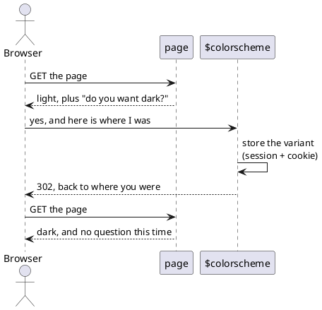
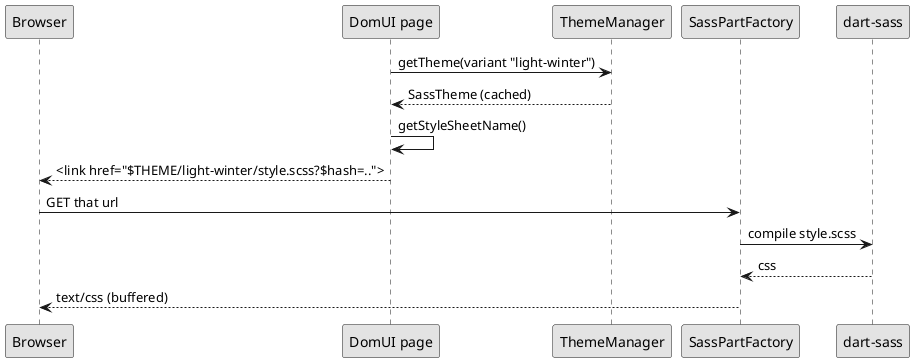

---
menu:
  sort: "10"
---
# Themes

A theme is a directory of SCSS with a `style.scss` in it. DomUI ships one,
`winter`. An application has exactly **one** theme, and it is chosen once, during
initialization, by handing `DomApplication` the factory that builds it:

```java
setThemeFactory(SassThemeFactory.INSTANCE);
```

That is all most applications ever do with themes. It cannot be changed
afterwards, and there is no way to have two themes in play at the same time.

What *can* differ from session to session is the theme's **colour scheme** - the
theme's variant. A scheme is light or dark, and the winter theme comes with six of them.

[TOC]

## Colour schemes

Every variant of the theme is a colour scheme of a **nature**, light or dark, and is
named for both: `light-winter`, `dark-nord`. The winter theme ships these, as constants
of `SchemeVariant`:

| Variant | Constant | What it looks like |
| --- | --- | --- |
| `light-winter` | `WINTER` | DomUI's light theme |
| `dark-midnight` | `MIDNIGHT` | deep indigo grounds, electric blue structure, neon accents (after Tokyo Night) |
| `dark-darcula` | `DARCULA` | neutral greys with muted colours (after IntelliJ's Darcula) |
| `dark-lagoon` | `LAGOON` | deep sea-green grounds with vivid teal structure |
| `dark-violet` | `VIOLET` | aubergine grounds, violet structure, pink and cyan accents (after Dracula) |
| `dark-nord` | `NORD` | arctic blue-grey grounds, frost blue structure: the calm one |

The theme review page in the demo shows every component in one go, in whichever scheme
you pick from the bar at its top:

!demo(to.etc.domuidemo.pages.themereview.ThemeReviewPage.ui)

Set a scheme on the request context and it holds for the rest of the session:

```java
UIContext.getRequestContext().setThemeVariant(SchemeVariant.NORD);
```

The stylesheet link is written by the *full* page renderer, so after switching the
page has to be reloaded for the new sheet to arrive. The demo does that with
`appendJavascript("WebUI.refreshPage();")`, which keeps the conversation and so
keeps whatever the user had typed. The sun/moon button at the top right of every demo
page is the whole of a dark/light switch - see `ThemeVariantSwitch` in the demo source.

### The schemes an application offers

`getThemeVariants()` in `DomApplication` returns the schemes a user can choose from, in
the order they are offered - it is what a scheme picker shows, with each one's
`getLabel()`. By default it is the theme's own list, the six above. Override it to leave
some out, or to add schemes of your own:

```java
static private final IThemeVariant OCEAN = new SchemeVariant(ThemeNature.DARK, "ocean", "Ocean");

@Override
public List<IThemeVariant> getThemeVariants() {
	return List.of(SchemeVariant.WINTER, OCEAN, SchemeVariant.NORD);
}
```

The order means something: the **first light** scheme is the default, the one a session
gets when nothing chose another (`getDefaultThemeVariant()`), and the first scheme of each
nature is what a browser that prefers that nature gets (see below).

A scheme that is not in the list is not recognised. A session, a cookie or a URL that
names one - an old name, a scheme the application stopped offering, a name made up - gets
the default instead of an error.

### Keeping the choice

To keep the choice for the sessions after this one too, name a cookie for it in
your `DomApplication.initialize()`:

```java
setThemeVariantCookieName("myapp-theme-variant");
```

Now press the switch, close the browser, come back: the page is still the way you
left it. The name is yours to choose, and there is no default, because every
application on a host would otherwise read the same cookie and a choice made in
one would carry into all the others. Without a name there is no cookie: the choice
lasts as long as the session, and the browser is not asked for its preference
either (see below), because the answer could not be kept.

## The first visit

A user who has not chosen anything yet gets the nature their desktop is set to.
The preference lives in the browser and the theme is a server side stylesheet, so
DomUI asks for it in the one place where the two meet - a script at the top of the
page head, before the stylesheet the browser is about to fetch:


```plantuml
@startuml
skinparam shadowing false
actor Browser
participant "page" as Page
participant "$colorscheme" as Part

Browser -> Page: GET the page
Page --> Browser: light, plus "do you want dark?"
Browser -> Part: yes, and here is where I was
Part -> Part: store the variant\n(session + cookie)
Part --> Browser: 302, back to where you were
Browser -> Page: GET the page
Page --> Browser: dark, and no question this time
@enduml
```

Because the script leaves before the stylesheet is fetched, nothing has been
painted yet: the user sees the page they wanted, not a flash of the other one.

The question is only put to a browser that has nothing stored, so it is asked once
and then never again - and pressing the switch answers it too. It is not asked at
all by an application without a theme cookie, since it could not keep the answer.
What each answer means is `getThemeVariantForColorScheme()` in your `DomApplication`:
the first scheme of that nature in `getThemeVariants()` - so for the winter theme a dark
desktop gets Midnight. An application that offers no dark scheme gets `null` there, and
the question is not asked.

To decide the scheme per user instead - from a preference stored with the account,
say - override `calculateUserThemeVariant()` in your `DomApplication`. It is asked
when neither the session nor the cookie holds a choice, so switch the browser
question off as well (`setColorSchemeDetection(false)`) or it will overrule what you
return:

```java
@Override
public IThemeVariant calculateUserThemeVariant(IRequestContext ctx) {
	return userPrefersDark(ctx) ? SchemeVariant.MIDNIGHT : super.calculateUserThemeVariant(ctx);
}
```

Sessions that get through all of that without a scheme render in the default, the first
light one.

## Where a theme file comes from

The style, the nature and the scheme become a **search path**, the same for every
scheme, tried in order until a file is found:

| Order | Path | Holds |
| --- | --- | --- |
| 1 | `$themes/scss/<style>/<nature>/<scheme>` | the scheme: `_scheme.scss` |
| 2 | `$themes/scss/<style>/<nature>` | the nature: its `_palette.scss` (light or dark), and its images |
| 3 | `$themes/scss/<style>` | everything else: every rule of the theme, the component colours |
| 4 | `$themes/scss/all` | what all themes share |

Because the first directory that has a file wins, a scheme or a nature overrides
exactly what it wants to and inherits the rest. No rule of the theme is repeated
anywhere; what differs is the colours, and a few images:

```
themes/scss/winter/                          style.scss, every component's partial, _component-colors.scss
themes/scss/winter/light/_palette.scss       the light nature: $color-scheme, and the scheme's roles passed on
themes/scss/winter/light/*.png, *.gif        the images that differ between light and dark
themes/scss/winter/light/winter/_scheme.scss the light scheme "winter"
themes/scss/winter/dark/_palette.scss        the dark nature, the same way
themes/scss/winter/dark/*.png, *.gif         the same images, made for a dark page
themes/scss/winter/dark/midnight/_scheme.scss
themes/scss/winter/dark/nord/_scheme.scss
...
```

### A scheme is one file

A scheme is the theme's colour **roles**, and nothing else: 97 colours, each named for what
it is *for* - a surface, a kind of text, an intent - and never for the component that paints
it. Every scheme states the same set, light or dark:

```scss
// themes/scss/winter/dark/nord/_scheme.scss
$surface-page: #2e3440;
$surface-raised: #343b49;
$text-default: #dee3ec;
$text-subtle: #b0b9c8;
$border-default: #434c5e;
$control-solid: #88c0d0;
$control-on-solid: #2e3440;
$danger-wash: #483d48;
$danger-text: #f0a0a7;
...
```

A role is named `$<family>-<step>`. The families without a colour of their own:

| Family | Roles | For |
| --- | --- | --- |
| `surface` | `-page`, `-raised`, `-overlay`, `-sunken`, `-band`, `-inverse` | what things stand on: the page, a panel on it, what floats (a popup, menu or window), something recessed (a gutter, a code block), a strip one step off its surface (a table header band, an alternate row), a dark spot in a light theme |
| `text` | `-default`, `-strong`, `-subtle`, `-faint`, `-inverse` | body text, emphasis and labels, secondary text and hints, a placeholder or another month's day, text on the inverse surface |
| `border` | `-subtle`, `-default`, `-strong`, `-bold` | from a divider, through the edge of a panel and a line with weight, to a hard frame |
| `field` | `-surface`, `-surface-readonly`, `-border`, `-border-hover` | inputs |
| `link` | `-text`, `-text-visited`, `-text-hover` | links |
| states | `$hover-wash` and `-border`; `$selected-wash`, `-solid`, `-on-solid`, `-border`; `$highlight`; `$focus-ring`; `$disabled-surface`, `-text`, `-border`; `$scrim`; `$shadow` | what applies to anything: under the pointer, selected, marked or found, keyboard focus, disabled, the veil behind a modal, what shadows are made of |

Selection has a hue no other role uses - a magenta in DomUI's schemes - so a selected row can
never be taken for a hovered, marked, informative or erroneous one.

Eight **colour families** have the same six steps:

| Family | Means |
| --- | --- |
| `primary` | the theme's accent: the default action |
| `control` | the normal colour of a control in use: a toggle that is on, the chosen item of a choice, a chip of a chosen value, a breadcrumb, a pager's buttons |
| `neutral` | an ordinary action, a plain title bar, a quiet fill |
| `info` | information, guidance |
| `success` | it worked, it is allowed |
| `warning` | caution, before a mistake |
| `danger` | an error, a destructive action |
| `chrome` | the application's frame: tab strips, tabs, table headers, headings |

| Step | What it is | Its promise |
| --- | --- | --- |
| `-wash` | the lightest tint: the ground of a message, an input in error | the family's `-text` and `$text-default` reach 4.5:1 on it |
| `-tint` | clearly coloured, still light: a tag, a label, a marked day | `$text-strong` reaches 4.5:1 on it |
| `-solid` | the full colour: a button, a flare, a badge | - |
| `-on-solid` | text and icons on `-solid` | 4.5:1 on it |
| `-text` | text in this family on an ordinary surface | 4.5:1 on the page and on its wash |
| `-border` | a border, an accent bar or a marker | decoration next to text that says the same |

So `$danger-wash` is the ground of an error message, `$danger-text` its text, and
`$danger-solid` with `$danger-on-solid` an error flare. The hover and pressed shades of a
`-solid` are not roles: the theme works them out from it. Last come seven **categories**,
`$category-1-solid`/`-wash` to `$category-7-...`: colours with no meaning, for things that only
have to be told apart, like the levels of a nested ConditionPanel. They are numbered, not named
after a hue, so that a scheme picks its own; neighbours differ most.

Every scheme DomUI ships keeps those promises, and a test (`TestThemeContrast`) holds it to
them: a new scheme is a copy of one of DomUI's with the colours changed, and it deserves the
same test.

The nature's `_palette.scss` decides very little. It says what the browser paints its own
canvas and scrollbars in (`$color-scheme: dark`), and passes the scheme's roles on, each
`!default`:

```scss
// themes/scss/winter/dark/_palette.scss
$color-scheme: dark !default;
$surface-page: s.$surface-page !default;
$text-default: s.$text-default !default;
...
```

That `!default` is what lets an application still set any role: an application's
[`_custominit.scss`](../overriding-the-theme/index.md) wins over every scheme.

### Where a colour is named

Colours live in two tiers.

The **roles** are the scheme's, above. **Component colours** are in
`_component-colors.scss`: one variable per colour a component paints, each defaulting to a
role. There is one copy of this file, for every scheme of both natures:

```scss
//-- TabPanel (.ui-tab-*)
$tab-hdr-bg: $chrome-wash !default;
$tab-bg: $chrome-tint !default;
$tab-color: $text-strong !default;
```

A component's own stylesheet reads its own variables, or a role directly - never a literal:

```scss
.ui-tab-hdr ul {
	background: $tab-hdr-bg;
}
```

That indirection is the point. An application restyles one component by setting one
component colour, or the whole theme by setting a role, and a scheme redresses everything
through its roles; none of them has to edit a component.

### Exceptions

A component colour that one nature, or one scheme, wants different from what
`_component-colors.scss` gives it is an **exception**: a plain declaration, like an
application's `_custominit.scss`, in a file the search path finds:

| File | For |
| --- | --- |
| `<nature>/_nature-exceptions.scss` | every scheme of that nature |
| `<nature>/<scheme>/_scheme-exceptions.scss` | that one scheme, outranking the nature's |

Neither nature, and none of DomUI's schemes, has any: every component colour is its role in
every scheme. The files are there, empty, for a scheme of your own that needs one. An
application's `_custominit.scss` and `_variant-custominit.scss` outrank both;
`_theme-configuration.scss` gathers all four into what the theme is configured with.

An application stylesheet that reads the theme with `@use "theme" as t;` gets the same
values the page shows, custominit files included: DomUI configures the theme for it the way
`style.scss` does, before the sheet itself is loaded.

### Things that nest

A component whose levels nest - a submenu inside a submenu - states each level as a
variable of its own: `$pmnu-bg`, `$pmnu-sm1-bg`, `$pmnu-sm2-bg`, `$pmnu-sm3-bg`, each a role
further off the menu than the one before, rather than walking a scale that would have to mean something
different in each nature.

### Images

An image that does not read on both natures has a copy with the same name in `light/`
and in `dark/`. The dark copies are not drawn by hand: `buildResources/dark-theme-images.sh`
in the DomUI source makes them from the light images, turning their lightness around while
keeping their colours, so a changed image is a re-run of the script. A
`THEME/btn-datein.png` in Java, or a `url()` in a stylesheet, gets the copy of the
session's nature; every other image comes from the theme directory, the same for all. An
image that must be there before anything can be loaded is no image at all: the sort arrows
of a table header and the spinner of the "waiting for the server" message are drawn by
css, in the scheme's colours.

A partial that still writes a colour literally cannot be redressed by a scheme - so when
you find one, give it a variable rather than overriding it. An application stylesheet can
read the theme's roles with `@use "theme" as t;` - which is what the demo's
`css/_darkstyle.scss` does for its own colours, inside a branch on `t.$color-scheme`.
The [parameters module](../sass-scss-support/index.md) holds the variant's name as well,
and its parts: `$themeVariant` (`dark-nord`), `$themeNature` (`dark`), `$themeScheme`
(`nord`).

The `$` on the front of `$themes` makes DomUI's resource resolver handle the
name, and it looks in four places, **in this order**:

1. a file in the webapp directory - `<webapp>/themes/scss/winter/style.scss`
2. in development mode, `META-INF/resources/themes/...` on the classpath,
   reloaded when it changes
3. a resource served by the servlet container
4. the classpath, under `/resources/` - which is where DomUI's own theme lives

An application file therefore **wins over the framework's**, and that is the
hook the whole of [overriding the theme](../overriding-the-theme/index.md)
hangs on - and how an application adds a scheme of its own.

## How the stylesheet reaches the browser


```plantuml
@startuml
skinparam monochrome true
skinparam shadowing false
participant Browser
participant "DomUI page" as Page
participant ThemeManager
participant SassPartFactory
participant "dart-sass" as Sass

Page -> ThemeManager: getTheme(variant "light-winter")
ThemeManager --> Page: SassTheme (cached)
Page -> Page: getStyleSheetName()
Page --> Browser: <link href="$THEME/light-winter/style.scss?$hash=..">
Browser -> SassPartFactory: GET that url
SassPartFactory -> Sass: compile style.scss
Sass --> SassPartFactory: css
SassPartFactory --> Browser: text/css (buffered)
@enduml
```

Every themed URL carries the variant as its first segment - `$THEME/light-winter/...`,
`$THEME/dark-nord/...` - so the scheme decides which file is served, and two schemes
never share a cache entry. A URL with a variant the application does not offer is served
from its default scheme.

Nothing is compiled ahead of time and nothing is written to disk. The page emits
a `$THEME/`-prefixed link whose query string carries a hash of the compiled
result, so the URL changes whenever the stylesheet does and the browser cache
never has to be reasoned about.

`ThemeManager` keeps the built `ITheme` objects in a map keyed by variant name.
It tracks the resources each was built from, so a changed file invalidates the
entry rather than being served stale.
