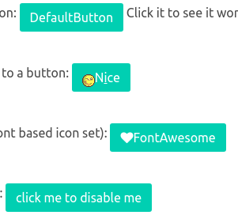
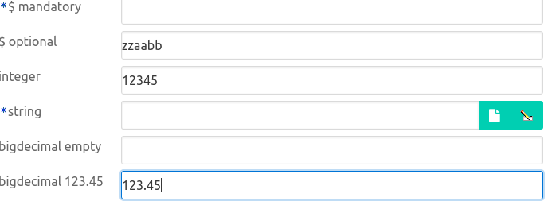

# Playing with Bulma

This logs the result of experimenting with Bulma as a styling framework around DomUI.

- Bulma is built using sass syntax. There appear to be no Java sass compilers that support sass format- only scss is supported. I implemented both vaadin-sass-compiler and jsass but both fail to load Bulma. So I converted Bulma to scss using sass-convert.

## Styling issues

### General look

The overall look of Bulma seems.... busy and flat. It uses lots of primary colors, no gradients, big colorful borders around input... Things are also quite big. I think having a business application rendered with Bulma will be considered nice at the start but very tiring after use. It definitely needs a more subdued look, but looking at the available themes the idea seems not to have dawned on others yet.

### H1..H6 tags are unstyled

All Hn tags have no style at all; Bulma tells us to use its classes to define headers instead. This is plain dumb: there is simply no reason to break rendering of these tags just because you have another idea. It should be fixed by having the Hn tags expose the same styles using **class='title is-2'**. Or alternatively wrap the thing in a class="content". See the silliness in [https://github.com/jgthms/bulma/issues/433](https://github.com/jgthms/bulma/issues/433) or even worse: [https://github.com/jgthms/bulma/issues/211](https://github.com/jgthms/bulma/issues/211). The author does not get an important point: his framework is there to help others. Removing all styles everywhere is not helping, it's vandalism.

This might also mean that there is more foolishness than this around. It means that including Bulma fscks up everything else: it's an all or nothing affair.

### Reset sheet

The above was caused by minireset.scss, so I removed everything from there.

### Buttons

- Buttons only work nice when used with font related icons. Buttons with an image inside render badly:

- To fix, add "icon" class to the image tag. This aligns the buttons correctly, but scales the icon images to 1.5em which for images makes them ugly.
- The colors used in button specification kind of suck. "is-white"?
- Buttons have no "focus" indication apparently, so it is not possible to see what button is currently selected.

### Input controls

Input controls are defined as width: 100%, which results in a screen like this:

While perhaps acceptable on a phone this is bad for any ERP gui, because there is no relation between the #of characters that are needed and the size on the screen. It makes scanning the form very hard.

Inputs also render badly when not contained by some size-restricting container, and especially the *has-addons* thingy behaves oddly as this does *not* fill all horizontal space. To get it to do that you need to add is-fullwidth, apparently. This is very inconsistent.

## Integration

As it is Bulma cannot just be included as it is too intrusive. We can fix that probably, by cloning and fixing. But we will be at odds with the author who has strong opinions on some things I at least also strongly disagree with :wink:

 It might be a bad race.

We also have another issue: to actually make use of Bulma almost all components must somehow "know" of it: some controls might need to render a different HTML structure (like FormBuilder, because Bulma uses different methods to render a tabular like form). More problematic still are the classes used: to style the components add class names to all important constructs so that those can be addressed to style them. How do we change those classes to bulma classes? This also needs to be done depending on the stylesheet used as existing stylesheets all use DomUI's classes. A naive solution would be to give each component a separate "rendering" part which is separate from its Java "interface" part, i.e. a Text control would be a Java part only implementing its Java side of behavior (properties, listeners et al) and  *another* class, created through some factory that changes when the stylesheet changes. This rendering class then renders the actual DomUI structures for the control. While possible this adds a huge amount of overhead in both coding and rendering.

I also thought about using some SCSS/SASS magic to let the existing ".ui-xxx" classes "extend" Bulma classes where possible. But I think this quickly dies...

TODO: Look at Vaadin and see how they handle this.

What IS nice about Bulma is some of the general concepts:

- Using semantic styling like "is-error", "is-primary".
- Using global style modifiers for things like combining elements
- Using flex and/or grid layout to handle responsiveness better.

It might be a good plan to steal the concepts instead of just using the framework?
