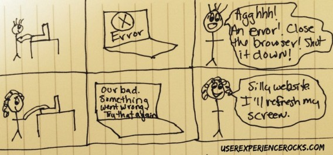

# Proposals for error handling

We should consider the following when handling errors:

- Error messages must be friendly and should not blame the user. Instead of "You entered the wrong address" something like "This address cannot be found".
- Error messages must explain what is wrong and if it is not obvious what needs to be done they need to explain possible solutions.
- Be humble.
- Avoid the following words in a message:
  - **Oops** something wasn't right
  - This form has **errors**
  - Form submission **failed**
  - There was a **problem** saving this data
  - Your input is **invalid**
  - Your form contains **wrong** data
  - These errors **prohibit** this from being stored
- Be Humble, Humorous, Human and Helpful

Showing error messages is also something:

- It must be clear *that* a message is an error message.
- It should be shown at the control that is the main cause
- It must be clear that it *belongs* to that control(!)
- Ideally, errors are reported as soon as the field is left (direct validation) instead of reporting only after clicking save.
- It should be clear that something is an error but errors should not "shout" or look scary. This makes people feel stress:

- Do not show errors one by one, i.e. do not stop validating after the first error. If multiple things are wrong it's best to show them all so that all can be fixed in one go.
