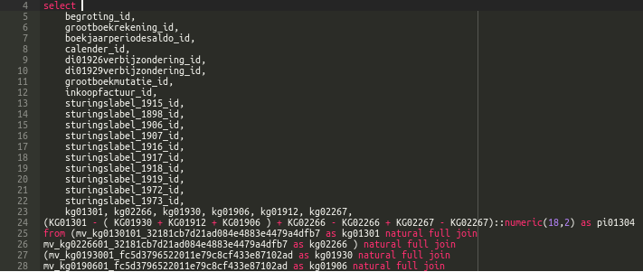

---
menu:
  sort: "10"
---
# DomUI 2.0 Changes

<a id="core-changes"></a>

## Core changes

<a id="hibernate-3610-upgraded-to-hibernate-5210final"></a>

### Hibernate 3.6.10 upgraded to Hibernate 5.2.10.Final

Most of this change should be transparent as long as you use DomUI's generic access layer. The one exception is configuring Hibernate where some changes have been made. The most important one is the part that facilitates participating in the Hibernate bootstrap process. The method HibernateConfigurator.addConfigListener now needs an interface implementation with methods for the different phases of Hibernate's bootstrap process. This was needed because 5.2 removed most functionality from the Configuration class.

The new interface has a set of methods that can be implemented to change parts of the configuration at the time these are done. See the IHibernateConfigListener for details.

<a id="basic-hibernate-jpa-support"></a>

### Basic Hibernate JPA support

DomUI works with Hibernate in JPA mode. It does assume that JPA initialization and bootstrap has been done, and provides the method

```
HibernateJpaConfigurator.initialize(entityManagerFactory)
```

to initialize access to the data functions within DomUI. Support is basic as more than one factory is not directly supported, but as you have the source code it should be easy to see where that can be fixed.

<a id="javascript-replaced-by-typescript"></a>

### Javascript replaced by TypeScript

One cannot really deny that [Javascript sucks like a black hole, really](https://wiki.theory.org/index.php/YourLanguageSucks#javascript_sucks_because), for bigger projects (in my opinion - like any other dynamically typed language). Inside DomUI the Javascript code became huge and was very hard to maintain - and buggy as well because no one knew what was called with what and returned whatever.

So, the Javascript code inside domui.js has been completely converted to [TypeScript](https://www.typescriptlang.org/). TypeScript, while having its own oddities, greatly helps with adding almost full static typing to Javascript, so things can be defined like this:

```
export function truncateUtfBytes(str: string, nbytes: number): number
```

In the process a great many bugs have been found and hopefully solved. Not everything is properly typescripted yet, but at least the current code forms a good basis to fix more. It is so unimaginably nice to actually get a *compiler error* for a mistake instead of some obscure console log line during testing.

The domui.js module has been split into several files that all together form a single namespace called WebUI, and almost all functions there are exported so they are globally visible. This ensures that existing calls to code remain working at the cost of still having bad TypeScript code. A later iteration will replace the namespace with several modules - but that requires all call sites to be visited.

One pretty huge sadness in TypeScript is that using a namespace with multiple files, while supported, is horribly implemented: you cannot easily define order between the files inside the namespace. To circumvent this for now the files are added to the \_files section of the tsconfig.json file in the correct order.

<a id="setclicked-argument-changed-breaking"></a>

### setClicked() argument changed (breaking)

The setClicked(IClickBase) method has been replaced by two separate methods:

- setClicked(IClicked<?>)
- setClicked2(IClicked2<?>)

This change allows for easier use of lambda's as the type for the method is now well-defined. So instead of **having** to write

```
d.setClicked((IClicked<Div>) b -> setCurrentTab(ti));
```

you can now invoke the lambda without a cast:

```
d.setClicked(b -> setCurrentTab(ti));
```

This change will some existing code as all calls to setClicked that passed a IClicked2 instance now need to use setClicked2.

<a id="inodecontentrenderer-removed-breaking-change"></a>

### INodeContentRenderer removed (breaking change)

This interface was the main interface to render generic content inside some NodeContainer. Its definition was this:

```
public interface INodeContentRenderer<T> {
   void renderNodeContent(@Nonnull NodeBase component, @Nonnull NodeContainer node, @Nullable T object, @Nullable Object parameters) throws Exception;
}
```

This interface was abused all over the place and makes it very unclear what parameters are *actually* passed into renderers, as the parameters component and parameters were often used in non-obvious ways. It also opened the doors for wide abuse, because renderers could abuse the values in component to actually "fix" the components rendering. This of course makes it impossible to maintain those components.

In addition the "object" parameter needed to be @Nullable because a lot of usages of this interface sometimes do pass a null value. But this makes it hard for the zillion places where this value is *never* null: it forces a check to be needed inside the implementation always.

The interface was replaced by the following:

```
public interface IRenderInto<T> {
   void render(@Nonnull NodeContainer node, @Nonnull T object) throws Exception;

   default void renderOpt(@Nonnull NodeContainer node, @Nullable T object) throws Exception {
      if(null != object)
         render(node, object);
   }
}
```

The implementer usually implements the render() method only. When there is a need to also handle nulls in a special way then the renderOpt() method needs to be overridden too.

This interface is used at most places where INodeContentRenderer was used. At places where indeed more than these two parameters are needed new interfaces will have been introduced which better describe the parameters and their expected use. Also see the notes about the content renderers for the LookupInput control.

For those not eager to replace all occurrences of INodeContentRenderer: you might be able to define it again in your own code, making it extend IRenderInto, and make the render() method call the old method inside INodeContentRenderer, something like:

```
public interface INodeContentRenderer<T> extends IRenderInto<T> {
   void renderNodeContent(@Nonnull NodeBase component, @Nonnull NodeContainer node, @Nullable T object, @Nullable Object parameters) throws Exception;
   default void render(@Nonnull NodeContainer node, @Nonnull T object) throws Exception {
       renderNodeContent(node, node, object, null);
   }
}
```

<a id="iprogress-replaced-with-progress"></a>

### IProgress replaced with Progress

The IProgress interface, used in all asynchronous tasks, has been replaced by the Progress implementation from to.etc.alg. The interface was completely useless as all async code created a specific implementation anyway, and the implementation was very limited in what it could do. The Progress implementation is fully threadsafe and allows nested accounting of progress.

<a id="using-enums-as-message-bundle-constants"></a>

### Using enums as message bundle constants

Using BundleRef's with String constants for the message names is very deprecated and will be removed. The replacement is to use enum classes that implement the new interface IBundleCode interface. The enum values act as key names for the messages, and because an enum is a class the BundleRef is associated directly with the enum too. It makes it way easier to work with message bundles. See the [metadata and internationalization page for more details](../../building-pages/80-metadata/index.md).

<a id="rendering-through-a-html-template"></a>

### Rendering through a HTML template

For cases where you want to embed DomUI pages inside a complex existing HTML page you can now render DomUI pages through a HTML template. You set the template to use per page, for instance:

```
getPage().setRenderTemplate(DomApplication.get().getResource("/mytemplate.html", ResourceDependencyList.NULL));
```

Inside the html template you need to place special constructs to indicate where DomUI can render its <head> and <body> information, by using:

```
<% r.renderHeadContent(); %>
```

and

```
<% r.renderBody(); %>
```

<a id="metadata-changes"></a>

### Metadata changes

<a id="initialization-of-metadata"></a>

#### Initialization of metadata

The mechanism that loads metadata from classes has been completely rewritten. The existing code tried to initialize all metadata in a single pass, and this could fail for more complex models when there were loops in definitions. This caused hard to fix issues.

The new mechanism uses a set of prioritized factories that each initialize one very specific piece of the metadata. Because these factories are strictly ordered at every step it is very clear what metadata has been initialized and what has not. This fixes most of the issues, at the expense of having metadata be more read/write.

<a id="searchpropertymetamodel-fixes"></a>

#### SearchPropertyMetaModel fixes

This interface and its implementation class suffered from the problems described above: they had to have both a property name and a property path to prevent loops in the old initialization. Having duplicate information is bad, and there was no need to have a path of properties in the thing. So the interface was changed: the properties *propertyName* and *propertyPath* have been replaced by a single new *property* which holds the PropertyMetaModel of the addressed search field.

<a id="private-and-protected-properties-can-be-used-in-binding-metadata"></a>

### Private and protected properties can be used in binding/metadata

When binding was used to connect properties to controls it required that the property bound to was public. But in many cases the binding and the properties are part of one (set of) classes, with no need to have those properties propagated to the outside world.

DomUI now detects private properties in its metamodel, and allows getting/setting the value of these properties through the metamodel. Some restrictions apply, however:

- Private properties are only detected in the actual class, not in parent classes.
- Odd definitions, like private setter and public getter, might have undesired results. The default for DomUI is to treat the private method as non-existing, so in this case it would present the property as read-only even though a private setter exists.

<a id="logger-changes"></a>

### Logger changes

DomUI uses the "etclogger" SLF4J backend by default. The code to initialize this was quite old, and had a lot of nasty things related to the config file's location. The initialization part has been rewritten to have less oddities surrounding the config file, so that no directories are created at wrong places.

The new default config file will be in WEB-INF if it is not expressly specified with a full path.

The default name of the config file is now etclogger.config.xml

<a id="default-testid-for-components-inside-a-form4-form"></a>

### Default testID for components inside a form4 form

The TestID for a component added by the form4 FormBuilder used to default to something derived of the label for the components. This, however, makes the thing fragile as the label is prone to change when the language changes. The new default is taken from any binding's property name if available, and only uses the label name if there is no binding known.

<a id="login-logout-and-current-user-related-code"></a>

## Login, logout and current user related code

<a id="current-user-login-logout-code-moved-to-uilogin"></a>

### "Current user", login/logout code moved to UILogin.

The UIContext static class contained a lot of methods that were related to logging in and logging out. Most of that code has now moved to the UILogin class.

<a id="login-brute-forcing-prevention-added"></a>

### Login brute forcing prevention added

To prevent code from brute-forcing the login we now count how many times a user failed to login. If the user fails login > 10 times in the last 5 minutes then all further login attempts will fail even when the correct credentials are passed. The login() method now returns an enum value which can be used to see that the login is actually ignored. The default values and the implementation of this can be changed by looking at DefaultLoginhandler and providing a new implementation.

<a id="impersonation-of-users-added"></a>

### Impersonation of users added

You can impersonate users by calling one of the following methods inside UILogin:

```
static void impersonate(@Nullable IUser user);
static public void impersonateByLoginId(@Nonnull String userId) throws Exception;
```

To call these the current user must have impersonation rights, which is determined by a new method in IUser: boolean canImpersonate().

When impersonating everything that uses the "current user" will use the impersonated user instead. This means that after impersonate the system acts as if you are the impersonated one.

!w This also means that you get all rights related to the impersonated user!

The "real" user behind the impersonated one can be obtained with UILogin.getRealUser().

To stop impersonating call UILogin.impersonate(null);

<a id="animations"></a>

## Animations

The animation methods slideUp(), slideDown(), fadeIn() and fadeOut() have been removed from the Div tag. They should be replaced by [calling Animations.xxxx with the node to animate](../../look-and-feel/animations/index.md).

<a id="new-components"></a>

## New components

<a id="aceeditor-editor-component"></a>

### AceEditor editor component

The AceEditor component encapsulates [Ace, a code editor written in Javascript](https://ace.c9.io/). It supports basic code editing functionality. Some basic calls to control the editor instance have been added to the component so that it is functional for most tasks.

The editor can use multiple themes and looks like this:



<a id="searchpanel-component-replacing-lookupform"></a>

### SearchPanel component replacing LookupForm

The LookupForm component was one of the oldest components in DomUI, and it had a very bad interface because it grew out of proportions. The new SearchPanel component replaces the LookupForm component (which is now deprecated and has moved to the legacy jar). The SearchPanel component has been rewritten so that every part of it can be easily extended and replaced without having to resort to arcane base classes. See [the description for more details](../../components/30-lookup-and-search/searchpanel/index.md).

<a id="component-changes"></a>

## Component changes

<a id="datatable"></a>

### DataTable

- Columns are now resizable with the mouse. Changes made by the user are sent to the server, so it is possible to persist those changes. See [the documentation](../../components/60-tables-and-trees/datatable/index.md) for details.
- The DataTable component has been merged with MultiRowDataTable, so that DataTable now supports rendering multiple rows per list value. The original DataTable has been moved to DataTableOld in legacy. The MultiRowRowRenderer has also been removed as 99.9% was the same as RowRenderer anyway.
- The RowRenderer now sets columns that are defined from metadata to SORT\_ASCENDING if the metadata specifies unknown sort. To prevent set the metadata to UNSORTABLE. This change means that tables are by default sortable.
- Column width length calculation has been fixed - [see the page for details](../../components/60-tables-and-trees/datatable/index.md). This mostly fixes the issue where column sizes changed every time we used the pager.
- The DataTable now defaults to a width of 100% by its own "setWidth" method, not by the style sheet. This allows the table to be used in < 100% things too by just calling setWidth(null) or anything else.
- You can change the size of columns by dragging their header edge, and there are listeners so that you can save the new column sizes in persistent storage for a user if you want. See the datatable page for details.

<a id="new-tree2-component"></a>

### New Tree2 component

The [new Tree2 component](../../components/60-tables-and-trees/tree3/index.md) is a rewrite of the now deprecated Tree component. It uses mostly the same interface but is rewritten with cleaner code and renders without using tables.

<a id="fileupload2"></a>

### FileUpload2

The FileUpload component moved to legacy. Two new components, FileUpload2 and FileUploadMultiple replace the thing.

The FileUpload2 component's constructor has changed:

- The old constructor FileUpload(int maxfiles, String allowedExtensions) has been removed because it was completely unclear what allowedExtensions was supposed to hold.
- The new constructor FileUpload(int maxfiles, List<String> allowedExtensions) is its replacement, and each element in the list is an extension (either with or without starting .) or a mime type.
- The new constructor FileUpload(String... allowedExtensions) represents the most common use case: uploading a single file, and specifying a list of extensions.

The FileUpload2 now uses the "accept=" attribute on the input tag to have the browser filter the files to choose from to the ones actually accepted.

The value type for FileUpload2 is UploadItem, for FileUploadMultiple it is List<UploadItem>. This properly represents their data type.

<a id="lookupinput-and-lookupinput2"></a>

### LookupInput and LookupInput2

The LookupInput component moved to legacy.

The test IDs for the buttons on the LookupInput have changed, so that it is easy to click one of the buttons of a specific lookup. With a LookupInput with testID = "one" the buttons would be called:

- one-lookup for the search button
- one-clear for the clear button

The generated html code for the controls has been changed so that [style fixes could be applied](../../components/30-lookup-and-search/lookupinput2/index.md). In addition, to reduce the maintenance of both LookupInput components, **both components now also share a common stylesheet** as they render the exact same layout. This breaks the existing legacy stylesheets! For fixes look at \_lookupInput.scss.

The value renderers used by this component have changed. In 1.0 the value renderers were not just responsible for rendering a value: they also placed the control's buttons and did a lot for the layout for the control. This was a bad plan, because it tightly couples those renderers to the control and anyone overridding those also need to know how the control renders. This made it impossible to change the rendering of the control. The new renderers are solely responsible for rendering the value in some reasonable way. All of the main layout of the control is done by the control itself. Consequently these renderers no longer need all the extra "hidden" parameters passed to INodeContentRenderer, and they now implement IRenderInto.

The LookupComponent2 has some new constructors which allows the component to be used on a List<T> of data.

Both components now share a common base class, AbstractLookupInputBase. This class contains all of the code that was duplicated earlier, and also contains most of the rendering code (as that is now common between both implementations). This removed more than 600 lines of duplications :wink:

<a id="tabpanel-variants"></a>

## TabPanel variants

TabBuilder:

- The builder's positionTab(int) method has changed to position(int).
- The builder has been rewritten to not use the tab instance class anymore, so that the tab instance class can be mostly immutable.
- The setTab() method has been removed as it exposes internal knowledge. Use label(NodeBase) instead.

TabPanels:

- The tab()....build() chain is now the preferred way to build new tabs
- All old "add" methods now return an ITabHandle.
- The builder now gives errors if its build method is not called.
- The TabBuilder and TabInstance classes are now final.
- The IDisplayListener class (of which the usage was one big bug) has been removed and has been replaced with onDisplay and onHide listeners that can be set on a tab.
- The setOnClose method in ITabHandle has been removed and has moved to the tab builder.
- Images used in the tab header can now be either a string or some supported font icon set name (like a constant from FaIcon).
- The ITabHandle interface now represents a tab, and all operations possible on it:
  - close() closes the tab associated with the handle
  - select() makes the tab the current tab
  - updateLabel() sets a new label name and optionally an image
  - updateContent sets new content into a tab. If the tab was defined as lazy the new content will be rendered only when the tab is made visible.
- The TabPanel.setLabel() method has been removed and is replaced with updateLabel() on a ITabHandle.

The look- and feel of the tab panel has changed from the sad, austere squares used before to a rounded look:


The tab panel html structure has changed too: the code now generates just the ul/li structure for the header, without "empty" li's. The basic structure is:

```
<div class="ui-tab-c">
  <div class="ui-tab-hdr>
    <ul><li>tab1</li><li>tab2</li></ul>
  </div>
  <div class="ui-tab-c">
    <div>...content for tab 1</div>
    <div>...content for tab 2</div>
  </div>
</div>
```

The content part of the tab is now a single div that *contains* the individual tab's content divs. This makes it easy to style the panels separately from the tab content area itself.

The whole look of the tab panel is now controlled by scss.

<a id="form-layout-and-form-builders"></a>

## Form layout and form builders

<a id="formbuilder-changes"></a>

### FormBuilder changes

All "old" form builders like VerticalFormBuilder, HorizontalFormBuilder, TabularFormBuilder and the old form2 package FormBuilders have moved to Legacy and should be removed from existing code.

The FormBuilder in package form4 has been extended:

- It has methods to also bind the readOnly and disabled properties of created controls automatically. This allows binding all controls to a single model property that for instance controls whether a user can change data.
- Several bugs have been fixed

In addition the form builder now uses a separate *IFormLayouter* to handle the actual generation of the form layout as DOM nodes. FormBuilder defaults to the ResponsiveFormLayouter for layout, this can be changed by passing a layouter instance when the form builder is created.

The old layout code in FormBuilder created a html table. This caused quite some issues because controlling layout and behavior of a table is hard. The ResponsiveFormLayouter renders the form as a simple set of div nodes. The structure generated is very simple: for each label and control pair the layouter generates:

```
<div class="ui-f5-pair ui-f5-pair-v">
  <div class="ui-f5-lbl ui-f5-lbl-v"><label xxxxx></div>
  <div class="ui-f5-ctl ui-f5-ctl-v">..... control....</div>
</div>
```

The -v is added for a vertical form, a horizontal form uses -h instead.

The entire form is inside a <div class="ui-f5 ui-f5-v"> div.

The stylesheet takes care of laying out the form which is done in a responsive way.

<a id="look-and-feel"></a>

## Look and feel

The following things have changed regarding themes, styles and look-and-feel.

<a id="using-fontawesome-with-domui"></a>

### Using FontAwesome with DomUI

You can [use FontAwesome](../../look-and-feel/icons/fontawesome-support/index.md) icons in most places where you would usually add an image resource.

<a id="sass-scss-support"></a>

### Sass scss support

The main theme is now a scss theme. Support for SASS scss style sheets is [natively included in DomUI](../../look-and-feel/sass-scss-support/index.md): there is no need to translate scss to css, it is done by DomUI's embedded sass part.

<a id="theme-and-stylesheet-changes"></a>

### Theme and stylesheet changes

- The new core stylesheet (scss/winter) removes all of the kludges:
  - The stylesheet reset has been removed, as it also removes any proper support for just displaying html. Components themselves are responsible for resetting browser specifics where needed.
  - The negative margins kludge has been removed.
  - Components themselves will not have margins anymore, so when two components are placed next to each other they will touch. In the new style sheet it is the responsibility of the *container* to handle the layout of its components properly.
- The DefaultButton (\_defaultbutton.scss) no longer uses a background image. It is restyled to use css3 with css3 transitions. The button also lost its margins; it is now properly the responsibility of the container css to layout its components properly.
- There was a duplicate component style sheet for LookupInput called \_lookupForm. It has been removed and its styles have been merged in the \_lookupInput stylesheet (scss only).

<a id="urlpage-default-classes-removed"></a>

### UrlPage default classes removed

In DomUI 1.0 UrlPage set the classes *ui-content* and *ui-kludge* on the body. These were needed to be able to fix some mistakes made in the css on a per-page basis, mainly the margins added to the default page.

The new scss style no longer does this, so these classes are removed. For code still depending on this it is easy to add them again by using a page listener registered in DomApplication, something like:

```
addNewPageInstantiatedListener(new INewPageInstantiated() {
   @Override
   public void newPageCreated(@Nonnull UrlPage body) throws Exception {}

   @Override
   public void newPageBuilt(@Nonnull UrlPage body) throws Exception {
     body.addCssClass("ui-content ui-kludge");
   }
}
```

<a id="datapager"></a>

## DataPager

The DataPager's look has been fixed so that it properly shows the overflow indicator, and that it uses CSS only for its presentation:


<a id="new-code"></a>

## New code

The new method MetaManager#query() and the new class ListQueryHandler make it possible to run QCriteria queries on collections.

<a id="qcriteria-api"></a>

## QCriteria API

<a id="changed-generic-parameter-for-qrestrictor"></a>

### Changed generic parameter for QRestrictor

The basic classes for QCriteria have been changed so that the return type for all chaining calls is now a generic parameter. This removed a whole lot of duplicated code, but with some small side effects...

The most important one is that QRestrictor<T> is now QRestrictor<T, R>, where R stands for the return type for all methods in the restrictor. This parameter is used in the definition of QCriteria and QSelection and others so that chained methods return the proper type. But QRestrictor<T> is also the result returned by or(), so all those calls need to change from:

QRestrictor<EvServer> or = c.or();

to

QRestrictor<EvServer, ?> or = c.or();

<a id="addition-of-typed-properties-to-all-qcriteria-methods"></a>

### Addition of typed properties to all QCriteria methods

With the completion of [typed properties](../../building-pages/40-typed-properties/index.md) we can now have fully typed properties without any extra work. All QCriteria related objects now have two forms for all calls: the existing form that used a String to contain a property name, and a new form that uses a QField<I, V> instance which is a typed property. This allows queries like:

```
@Test
public void testFindAlbumsByArtist() throws Exception {
   List<Album> query = dc().query(QCriteria.create(Album.class).eq(Album_.artist().name(), "AC/DC"));
   System.out.println("Got " + query.size() + " results");
   Assert.assertNotEquals(0, query.size());
}
```

<a id="fixes"></a>

## Fixes
