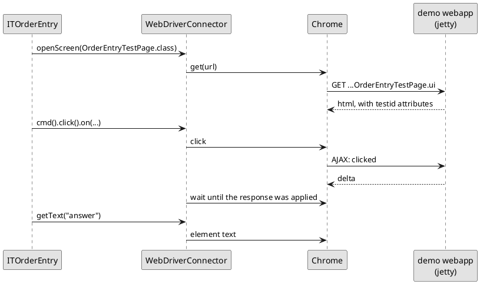

# Writing a UI test

A UI test is an ordinary JUnit test that happens to have a browser attached.
It opens a page, does what a user would do, and asserts on what the browser
ends up showing.

[TOC]

## A test

```java
public class ITOrderEntry extends AbstractWebDriverTest {
	/** The Order link of the second row of the basket. */
	static private final By ORDER_REVOLVER = By.cssSelector("*[testid='basket'] tbody tr:nth-child(2) a");

	@Test
	public void orderingSaysWhatWasOrdered() throws Exception {
		wd().openScreen(OrderEntryTestPage.class);

		wd().cmd().type("Ozymandias").on("customer", "input");
		wd().cmd().click().on(ORDER_REVOLVER);

		Assert.assertEquals("Ozymandias ordered 1 x Revolver, Standard, total 16.45", wd().getText("answer"));
	}

	@Test
	public void anEmptyCustomerStopsTheOrder() throws Exception {
		wd().openScreen(OrderEntryTestPage.class);

		wd().cmd().click().on(ORDER_REVOLVER);

		//-- The mandatory customer field reports itself, and the handler never got past it.
		Assert.assertTrue("The customer field should be marked as being in error",
			wd().getAttribute("customer", "class").contains("ui-input-err"));
		Assert.assertEquals("Nothing ordered yet", wd().getText("answer"));
	}
}
```

The page it drives is `OrderEntryTestPage` in the demo application - a form, a
basket, and an answer that changes when something is ordered:

!demo(to.etc.domuidemo.pages.test.uitest.OrderEntryTestPage.ui, 100%, 480)

Press an Order link with the customer field empty and the mandatory field
reports itself, exactly as the second test asserts.

## What the test is made of

`AbstractWebDriverTest` gives one thing: `wd()`, a `WebDriverConnector`. The
connector is a wrapper around Selenium's `WebDriver` that knows about DomUI -
about testids, about the fact that a click causes an AJAX round trip that has
to finish before the next assert can look at the page.

Each test method gets a fresh connector state: cookies are deleted between
tests, so a test never inherits a login or a conversation from the one before
it. When a test needs the *same* screen for all its methods, extend
`AbstractSinglePageWebDriverTest` instead and open the screen in the
`initializeScreen()` method it makes you implement.



The class name matters: a test whose name starts with `IT` is run by failsafe,
after the web application has been started. See
[running the tests](../20-running-the-tests/index.md).

## Finding things: the testid

Selectors like `div > table > tbody > tr:nth-child(2)` break the moment a
designer adds a wrapper. DomUI therefore renders a **`testid` attribute** on
nodes, and tests address elements by that:

```java
wd().cmd().type("Ozymandias").on("customer", "input");     // testid, plus the tag inside it
String answer = wd().getText("answer");                    // by testid
By b = wd().byId("customer");                              // *[testid='customer']
```

A control is a `div` with an `input` inside it, so `on("customer", "input")`
means "the input inside the component whose testid is customer".

!i The attribute is only rendered when the application runs in **UI test mode**.
!i That is on when `domui.testui=true` is set (failsafe and the jetty plugin
!i both set it for the demo), and on by default in development mode.

## Where a testid comes from

Either you set it, or DomUI calculates one:

```java
Text2<String> customer = new Text2<>(String.class);
customer.setTestID("customer");                     // explicit: rendered as it is
```

...and when nothing was set, the component asks itself what it should be
called. The calculated ids are predictable:

| Component | Calculated testid | From |
| --- | --- | --- |
| any control on a form | `customer` | the form builder, from the label, lowercased |
| `DefaultButton` | `button_Clear` | the button text |
| `LinkButton` | `lbtn_Order` | the link text |
| `SmallImgButton` | `sib_Reload_the_page_fully` | the title |
| `RadioButton` | `rb-Express` | the button's value |
| `DataTable` | `dt_1` | a counter |

Two components that end up with the same name get a `_1`, `_2` suffix, in the
order they were built.

The order entry page above sets a testid on two nodes only - the basket and the
answer - and lets the three form controls, the link buttons and the Clear
button name themselves.

!! A calculated id is a convenience, not a contract: change a button's text and
!! its testid changes with it, and the test that used it stops finding it. Set
!! the id yourself on everything a test must not lose sight of.

### Inside a repeating structure

A row of a `DataTable` is a repeating structure, so every *calculated* id
inside it is prefixed with the row's repeat id:

```html
<a testid="/r0/lbtn_Order">Order</a>       <!-- row 0 -->
<a testid="/r1/lbtn_Order">Order</a>       <!-- row 1 -->
```

An id you set yourself is left alone - the two display columns of the basket
render `testid="title"` and `testid="price"` in every row. Addressing a
component in a table by hand is therefore awkward, which is what
[page objects](../30-page-objects/index.md) are for.

## Doing things: the command builder

`wd().cmd()` builds one action and ends with `on(...)`, which says where it
lands:

```java
wd().cmd().type("Ozymandias").on("customer", "input");   // type into it
wd().cmd().click().on("button_Clear");                   // click it
wd().cmd().check(true).on("agreed");                     // tick a checkbox
wd().cmd().clickable().timeout(5000).click().on(b);      // wait for it first
```

`present()`, `visible()`, `invisible()` and `clickable()` are conditions that
must hold before the action is done; `timeout()` and `interval()` change how
long the connector keeps trying. The default is a 60 second timeout with a
250ms interval, and it is reset for every test.

## Looking at things

| Call | Answers |
| --- | --- |
| `getText(testid)` | the text inside the element |
| `getValue(testid)` | the value of an input |
| `getAttribute(testid, name)` | one attribute - `class` to check for an error state |
| `isPresent(testid)`, `isVisible(testid)` | whether it is in the DOM / shown |
| `isEnabled`, `isEditable`, `isChecked` | the state of a control |
| `countMatching(css)` | how many elements match |
| `screenInspector()` | the pixels; see [rendering tests](../60-rendering-tests/index.md) |

## Waiting

The connector waits by itself after an action that causes a round trip, so most
tests need no waiting at all. When something is slower than a round trip - a
query, an asynchronous component - say what you are waiting for:

```java
wd().wait(wd().byId("results"));                       // until it is there
wd().waitForElementVisible("results");                 // until it is shown
wd().notPresent("busy");                               // until it is gone
waitForRefreshOf(page.basket(), Duration.ofSeconds(5), () -> page.buttonClear().click());
```

`waitForRefreshOf` runs the action and then waits until *that* element has been
replaced by the server's answer, which is the honest way to wait for a piece of
screen to be rebuilt.

## Next

The test above works, but the two selectors at the top of it are the beginning
of a problem: they describe the *html* of a screen inside a test that should be
about ordering an album. [Page objects](../30-page-objects/index.md) put them
where they belong.
