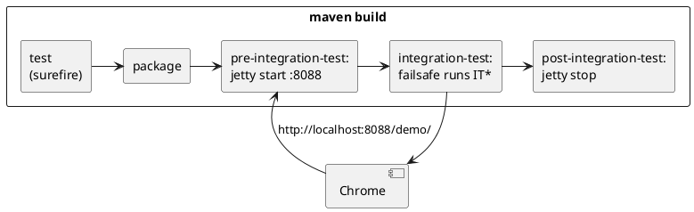

# Running the tests

```bash
mvn21 verify -pl to.etc.domui.demo
```

That is the whole thing: maven builds the module, starts a jetty with the demo
web application on it, runs every UI test against that jetty, and stops it
again.

[TOC]

## Two kinds of test

| Class name | Plugin | When it runs | Needs |
| --- | --- | --- | --- |
| `Test*` | surefire | `mvn test`, during the normal build | nothing |
| `IT*` | failsafe | `mvn verify`, after the application is packaged | a browser and a driver |

The split is what makes the UI tests bearable: they are slow and they need a
browser, so they stay out of `mvn test` and of every build that stops before
the `integration-test` phase. A build that goes all the way - `verify` or
`install` - runs them, and `-DskipTests` skips them along with the rest.

## What starts, and where the test finds it

The jetty maven plugin is bound to `pre-integration-test` and `post-integration-test`
in the demo's pom, and failsafe is told where the application then is:

| Property | Value | Meaning |
| --- | --- | --- |
| `webdriver.url` | `http://localhost:8088/demo/` | the base URL the tests open pages on |
| `webdriver.hub` | `chrome` | the browser: headless Chrome, on this machine |
| `domui.testui` | `true` | the server renders `testid` attributes |

`openScreen(SomePage.class)` builds its URL from `webdriver.url` plus the fully
qualified class name of the page, so nothing in a test names a host or a port.



## The browser and its driver

`webdriver.hub` says which browser, and where it runs: `browser@destination`,
with the destination left off meaning this machine.

| Value | What you get |
| --- | --- |
| `chrome` | headless Chrome - the default, and what the build uses |
| `chrome-desktop` | a Chrome you can watch the test drive |
| `firefox` | Firefox |
| `chrome@http://somehost:4444/wd/hub` | a remote Selenium hub |

**Chrome** has to be installed; the **chromedriver** does not. On the first
local Chrome test the framework asks
[WebDriverManager](https://github.com/bonigarcia/webdrivermanager) for the
driver that matches the installed Chrome, which downloads and caches it - so a
machine with Chrome and a network connection needs no further preparation.

To use a driver of your own instead, name it in `webdriver.chrome.driver`; the
paths `/usr/local/bin`, `/usr/bin`, `~/bin` and `~` are searched as well.
Chrome itself is looked for in `/usr/local/bin/google-chrome`,
`/usr/bin/google-chrome` and `/Applications/Google Chrome.app`, or wherever
`webdriver.chrome.executable` says.

## Test properties

Everything above is read through `TestProperties`, which looks at the JVM's
system properties first and at a properties file second. The file is
`~/.test.properties` unless `VPTESTCFG` or `-DtestProperties=` names another
one. So a property set with `-D` on the command line always wins:

```bash
mvn21 verify -pl to.etc.domui.demo -Dwebdriver.hub=chrome-desktop
```

| Property | Default | What it does |
| --- | --- | --- |
| `webdriver.url` | - | required: the base URL of the application under test |
| `webdriver.hub` | `chrome` | browser and destination |
| `webdriver.waittimeout` | 60 | how many **seconds** a wait keeps trying |
| `forcelocale` | - | a language tag; the browser asks for that locale |
| `webdriver.chrome.driver` | downloaded | the chromedriver binary to use |
| `webdriver.chrome.executable` | searched | the Chrome binary to use |

## Running one test from the IDE

Failsafe's jetty is not there when you press Run in the IDE, so start one
yourself and point the test at it:

```bash
mvn21 jetty:run -pl to.etc.domui.demo          # http://localhost:8088/demo/
```

and run the test with `-Dwebdriver.url=http://localhost:8088/demo/` (plus
`-Dwebdriver.hub=chrome-desktop` if you want to watch it). The jetty plugin is
configured with `domui.testui=true`, so the pages it serves carry their
testids.

## When a test fails

Every failing UI test writes a screenshot of the browser at the moment it
failed:

```
to.etc.domui.demo/target/failsafe-reports/ITOrderEntry_orderingSaysWhatWasOrdered.png
```

That is usually enough to see what went wrong - a dialog that was still open, a
field that was never filled, an error message the test did not expect. A test
can also take one itself with `snapshot("before ordering")`.

!! Chrome does not take a full-page screenshot through the WebDriver protocol:
!! it captures the viewport only. DomUI works around that with a Chrome-specific
!! screenshot helper, which is also what makes
!! [rendering tests](../60-rendering-tests/index.md) possible.
