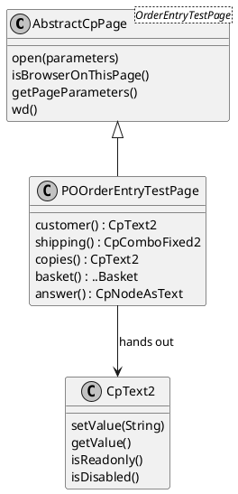

# Page objects

The same two tests as on the [previous page](../10-writing-a-ui-test/index.md),
written against a page object:

```java
public class ITOrderEntryPageObject extends AbstractWebDriverTest {
	@Test
	public void orderingSaysWhatWasOrdered() throws Exception {
		POOrderEntryTestPage page = new POOrderEntryTestPage(wd());
		page.open();

		page.customer().setValue("Ozymandias");
		page.shipping().setValue("Express");
		page.copies().setValue("2");
		page.order("Revolver");

		Assert.assertEquals("Ozymandias ordered 2 x Revolver, Express, total 34.95", page.answer().getText());
	}

	@Test
	public void theBasketShowsWhatIsForSale() throws Exception {
		POOrderEntryTestPage page = new POOrderEntryTestPage(wd());
		page.open();

		Assert.assertEquals(3, page.basket().getVisibleRowCount());
		Assert.assertEquals("Rubber Soul", page.basket().row(0).album().getText());
		Assert.assertEquals("14.95", page.basket().row(0).priceEach().getText());
	}
}
```

Not one testid, not one css selector, no `input` inside a `div`: the test says
what it does. Everything about *how* the screen is built sits in
`POOrderEntryTestPage`, and when the screen changes, that is the only place
that changes with it.

[TOC]

## What a page object is here

A **page object** is a class that represents one screen. It knows the page
class, so it can open it, and it hands out one **proxy** per component on it.



Each proxy holds a **supplier of a css selector**, not an element: it is asked
for the element again on every call, so a proxy survives the page being rebuilt
by an AJAX round trip - which an ordinary Selenium `WebElement` does not.

```java
customer = new CpText2(this.wd(), () -> "*[testId='customer']");
```

## The proxies that exist

They live in `to.etc.domui.webdriver.poproxies`. Every input proxy implements
`ICpControl<T>`, which is `setValue`, `getValue`, `isReadonly` and
`isDisabled`, and every proxy inherits `isPresent()`, `isDisplayed()`,
`getText()` and the `waitTillPresent()` calls from `AbstractCpComponent`.

| Proxy | For |
| --- | --- |
| `CpText2`, `CpText`, `CpTextArea`, `CpHtmlInput` | text input |
| `CpCheckbox`, `CpCheckboxButton`, `CpRadioGroup<T>` | choice input |
| `CpComboFixed2`, `CpComboLookup2`, `CpComboFixed`, `CpComboLookup` | dropdowns; the value is the option's *label* |
| `CpLookupInput2`, `CpLookupInput`, `CpNumberLookupControl` | lookup controls |
| `CpButton`, `CpLinkButton` | things that are clicked |
| `CpDisplaySpan`, `CpNodeAsText` | things that only show text |
| `CpDataTable<R>`, `CpDataTableColumn`, `CpDataTableRowBase` | a table, its columns and its rows |
| `CpWindow`, `CpMsgBox` | a floating window and a message box |
| `CpTabPanel`, `CpAceEditor` | the tab panel and the code editor |

`AbstractCpPage<T>` is the base of the page object itself: `open(parameters)`
opens the page it is typed on, `isBrowserOnThisPage()` and
`waitUntilPageUrlContains()` answer questions about where the browser ended up,
and `getPageParameters()` returns the parameters in the current URL.

## Writing one by hand

A page object is an ordinary class; nothing forces you to generate it:

```java
public class POLoginPage extends AbstractCpPage<LoginPage> {
	private CpText2 m_userName;

	public POLoginPage(WebDriverConnector connector) {
		super(connector, LoginPage.class);
	}

	public CpText2 userName() {
		CpText2 userName = m_userName;
		if(null == userName) {
			userName = new CpText2(wd(), () -> WebDriverConnector.getTestIDSelector("username"));
			m_userName = userName;
		}
		return userName;
	}
}
```

A proxy per component, made once and kept in a field, behind a method named
after the component. That is a lot of very regular typing, which is why the
[generator](../40-generating-page-objects/index.md) exists: it writes exactly
this, by looking at the page while it is on the screen.

## Tables

A table needs three classes, and this is the shape the generator produces as
well: the table (a `CpDataTable`) hands out **columns** and **rows**, and a row
hands out the components in its cells.

```java
page.basket().getVisibleRowCount();          // rows on this page of the table
page.basket().row(0).album().getText();      // a cell of a row
page.basket().row(1).order().click();        // the link button in a cell
```

Row and column numbers are zero-based, and `row(n)` is the *n*th row currently
rendered, not the *n*th row of the model: a table that pages shows the rows of
the current page only.

## Steps of your own

A page object is also the place for the vocabulary of your tests. The order
entry object has one:

```java
	/**
	 * Order the album with this title, whichever row of the basket it is in.
	 */
	public void order(String album) throws Exception {
		for(int i = 0; i < basket().getVisibleRowCount(); i++) {
			if(album.equals(basket().row(i).album().getText())) {
				basket().row(i).order().click();
				return;
			}
		}
		throw new IllegalStateException("The basket does not contain " + album);
	}
```

The test then says `page.order("Revolver")` and no longer cares which row
Revolver is in - the difference between a test that survives a new album in the
basket and one that does not.
