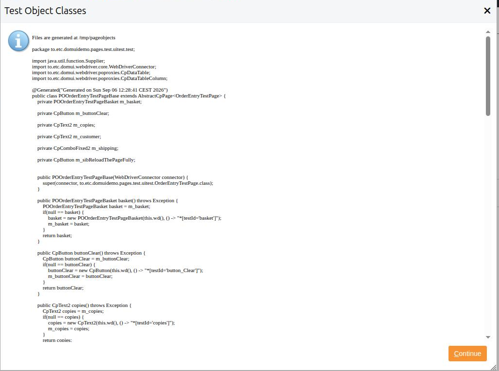
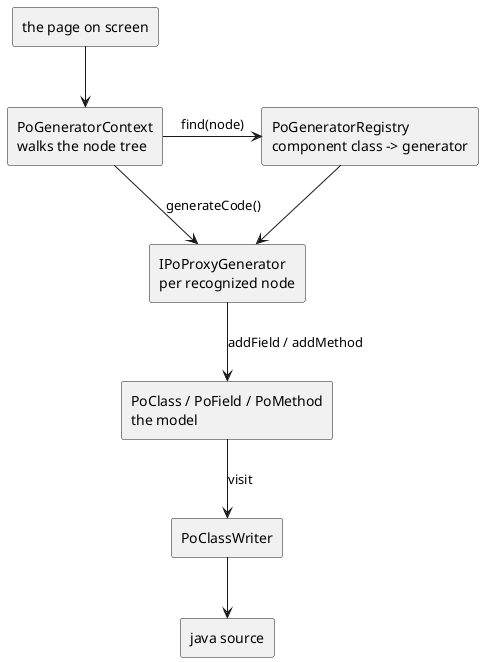

# Generating page objects

A page object is a mechanical thing: one field, one lazy getter and one
selector per component on the screen. DomUI writes it for you, by looking at
the page while it is running in your browser.

[TOC]

## Running it

Open the page, get it into the state you want the page object to describe, and
press **Ctrl-Shift-`** twice within a quarter of a second (the backtick/tilde
key). A window opens with the generated code:



The classes are written to files as well, under `/tmp/pageobjects`, in
directories matching their package - so they can be copied straight into
`src/test/java`. That directory is emptied on every run.

!! The generator works from the tree that is **on the screen**, not from your
!! source code. A table generates row and cell accessors only when it has rows
!! in it, a dialog only when it is open, and a tab only when it is the tab you
!! are looking at. Bring the screen into the state you want described, then
!! generate.

Two things have to be true for the key to do anything:

- the application runs in **development mode** - that is what puts the key
  handler in the page;
- there is a `.developer.properties` file in your home directory, which is what
  `DeveloperOptions.isDeveloperWorkstation()` answers on.

Neither is ever true in production, so the generator cannot be reached there.

## What comes out

For the order entry page - a form of three controls, a `DataTable` with a link
button in every row, a button and a `Div` - the generator writes four classes
in the package `to.etc.domuidemo.pages.test.uitest.test`: the page's own
package plus `.test`.

**`POOrderEntryTestPageBase`** - the page object itself, marked `@Generated`:

```java
@Generated("Generated on Sun Sep 06 12:13:35 CEST 2026")
public class POOrderEntryTestPageBase extends AbstractCpPage<OrderEntryTestPage> {
	private POOrderEntryTestPageBasket m_basket;

	private CpButton m_buttonClear;

	private CpText2 m_customer;

	...

	public POOrderEntryTestPageBase(WebDriverConnector connector) {
		super(connector, to.etc.domuidemo.pages.test.uitest.OrderEntryTestPage.class);
	}

	public CpText2 customer() throws Exception {
		CpText2 customer = m_customer;
		if(null == customer) {
			customer = new CpText2(this.wd(), () -> "*[testId='customer']");
			m_customer = customer;
		}
		return customer;
	}
	...
}
```

**`POOrderEntryTestPage`** - an empty subclass of it, which is where *your*
code goes. It is generated once as a starting point and then left alone by you
regenerating; see [extending it](#extending-what-was-generated) below.

**`POOrderEntryTestPageBasket`** and **`POOrderEntryTestPageBaseBasketRow`** -
the table and its row. The table hands out columns and rows, the row hands out
what is inside the cells:

```java
public class POOrderEntryTestPageBaseBasketRow extends CpDataTableRowBase {
	public CpDisplaySpan album() throws Exception { ...
		album = new CpDisplaySpan(this.wd(), () -> this.getCellComponentSelectorCss(0, "title"));
	}

	public CpLinkButton order() throws Exception { ...
		order = new CpLinkButton(this.wd(), () -> this.getCellComponentSelectorCss(2, "lbtn_Order"));
	}
}
```

The column index comes from the position of the column in the table, and the
name of the method from the column's header text (`Price each` becomes
`priceEach()`), falling back to `column3` for a column with no header.

The names of everything else come from the **testid**: `customer` from the form
label, `button_Clear` from the button's text, `lbtn_Order` from the link's
text. Which is the reason to give the components a test id of your own where it
matters - the generated method is named after it.

## The model it builds

The generator does not write text: it builds a model of classes, fields and
methods and then asks a writer to render Java from it. Two halves, and the
seam between them is the reason a generator for a component of your own is
about twenty lines.



| Class | What it is |
| --- | --- |
| `PageObjectGenerator` | the whole run: walk, prepare, generate, write |
| `PoGeneratorContext` | the run's state: the page, the classes made so far, the errors, and the name rules |
| `PoGeneratorRegistry` | which generator handles which component class |
| `IPoProxyGenerator` | one recognized node: `acceptChildren()`, `prepare()`, `generateCode()` |
| `IPoSelector` | how the proxy will find its element: by testid, by cell, by row |
| `PoClass`, `PoField`, `PoMethod`, `RefType` | the model of the java that will be written, imports included |
| `PoClassWriter` | renders the model as source |

### The walk

`PoGeneratorContext.createGenerators()` walks the built node tree and asks the
registry for a generator for every node. What the generator answers from
`acceptChildren()` decides how the walk continues:

| Answer | Meaning |
| --- | --- |
| `Accepted` | this node is mine, and so is everything in it - do not walk into it |
| `RefusedScanChildren` | not for me; walk into my children and see what is there |
| `RefusedIgnoreChildren` | not for me, and there is nothing inside worth looking at |

A node that is accepted **must have a testid** by then, otherwise it is
reported as an error in the result window and skipped. Since a testid is
allocated while the page is rendered, that is another reason the generator
works on a page that is on the screen.

A node that no generator claims but that is an `IControl` is an error too - it
says, in the window, that there is a control the generator has no proxy for.

### Two passes

Everything is asked to `prepare()` before anything is asked to
`generateCode()`, so a generator that needs a class that another generator
creates cannot be tripped up by the order of the walk.

### Selectors

`generateCode()` is handed an `IPoSelector`, which is what ends up inside the
lambda in the generated code:

| Selector | Generates | Used for |
| --- | --- | --- |
| `PoSelectorTestId` | `() -> "*[testId='customer']"` | a component on the page |
| `PoSelectorCell` | `() -> this.getCellSelectorCss(1)` | a cell that holds nothing but text |
| `PoSelectorCellComponent` | `() -> this.getCellComponentSelectorCss(2, "lbtn_Order")` | a component inside a cell |
| `PoSelectorRow` | `() -> this.getRowSelector()` | the row itself |

A selector is a `Supplier<String>` in the generated code, evaluated on every
use, which is what lets a row proxy compute its selector from its row index.

## What is recognized

| Component | Proxy generated |
| --- | --- |
| `Text2`, `TextArea`, `Input` | `CpText2`, `CpTextArea`, `CpHtmlInput` |
| `Checkbox`, `CheckboxButton` | `CpCheckbox`, `CpCheckboxButton` |
| `ComboFixed2`, `ComboLookup2` | `CpComboFixed2`, `CpComboLookup2` |
| `RadioGroup` | `CpRadioGroup<T>`, with the value of every button in it |
| `LookupInput2`, `NumberLookupControl` | `CpLookupInput2`, `CpNumberLookupControl` |
| `DefaultButton`, `SmallImgButton`, `LinkButton` | `CpButton`, `CpButton`, `CpLinkButton` |
| `DisplaySpan` | `CpDisplaySpan` |
| `DataTable` | a table class, a row class and a column accessor per column |
| `Window`, `Dialog` and their subclasses | a class of their own, holding what is inside the window |

`PoGeneratorRegistry` is the authority on this list; the superseded
first-generation controls are registered as well.

Anything else - a `Div`, a `Span`, a `Table` you built yourself, a component of
your own - is walked *through*, not generated. Its children are found, it is
not.

## Extending what was generated

### Your own code, in the subclass

The split between `POOrderEntryTestPageBase` and `POOrderEntryTestPage` exists
for exactly this: **the Base is regenerated, the subclass is yours**. When the
screen changes you generate again, copy the new Base over the old one, and
everything you wrote is untouched.

```java
public class POOrderEntryTestPage extends POOrderEntryTestPageBase {
	private CpNodeAsText m_answer;

	public POOrderEntryTestPage(WebDriverConnector connector) {
		super(connector);
	}

	/** The answer is a plain Div, so the generator does not make a proxy for it. */
	public CpNodeAsText answer() {
		CpNodeAsText answer = m_answer;
		if(null == answer) {
			answer = new CpNodeAsText(wd(), () -> WebDriverConnector.getTestIDSelector("answer"));
			m_answer = answer;
		}
		return answer;
	}

	/** Order the album with this title, whichever row of the basket it is in. */
	public void order(String album) throws Exception {
		...
	}
}
```

Two kinds of thing belong here: proxies for what the generator cannot
recognize, and the steps your tests speak in.

### Your own component

A component of your own gets generated once you say what its proxy is. First
write the proxy - a class extending `AbstractCpComponent`, or
`AbstractCpInputControl<T>` when it holds a value:

```java
public class CpStarRating extends AbstractCpInputControl<Integer> {
	public CpStarRating(WebDriverConnector wd, Supplier<String> selectorProvider) {
		super(wd, selectorProvider);
	}

	@Override
	public void setValue(@Nullable Integer value) {
		wd().cmd().click().on(selector(".dm-rating-star-" + value));
	}

	@Nullable
	@Override
	public Integer getValue() {
		return wd().countMatching(selectorCss(".dm-rating-on"));
	}
}
```

...and then register it, once, somewhere that runs before you generate - the
`initialize()` of your `DomApplication` is the obvious place:

```java
PoGeneratorRegistry.register(StarRating.class, (ctx, node) -> new PogSimple(node, new RefType("com.example.test", "CpStarRating")));
```

`PogSimple` is the generator for "a component that is one proxy": it writes the
field, the lazy getter and the constructor call. The two-argument form taking a
*name* assumes DomUI's own proxy package, so a proxy of your own is named with
a `RefType` that carries its package.

`registerExtends()` registers for a class **and its subclasses**, which is how
every `Window` and `Dialog` is handled by one generator.

### A generator of your own

When one proxy is not enough - your component contains other components, or it
needs a class of its own like `DataTable` does - write an
`IPoProxyGenerator`. `AbstractPoProxyGenerator` gives the two methods you
usually do not need, leaving `generateCode()`:

```java
public class PogStarRating extends AbstractPoProxyGenerator {
	public PogStarRating(NodeBase node) {
		super(node);
	}

	@Override
	public void generateCode(PoGeneratorContext context, PoClass into, String baseName, IPoSelector selector) throws Exception {
		RefType type = new RefType("com.example.test", "CpStarRating");
		PoField field = into.addField(type, PoGeneratorContext.fieldName(baseName));
		PoMethod getter = into.addMethod(type, baseName);
		getter.appendLazyInit(field, variable -> {
			getter.append(variable).append(" = new ");
			getter.appendType(into, type).append("(this.wd(), ").append(selector.selectorAsCode()).append(");").nl();
		});
	}
}
```

`addField` and `addMethod` take care of the import, `appendLazyInit` writes the
"make it once" body around what you append, and `context.addClass()` makes a
whole new class when your component needs one. `PogDataTable` is the worked
example of all of it: it detects the columns from the rendered `THEAD`, the
content of the cells from the rendered rows, and generates three classes.
