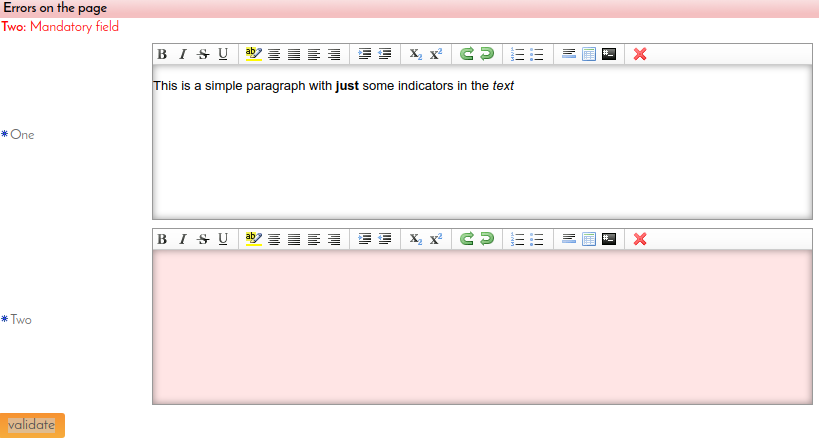

---
menu:
  sort: "10"
---
# The HtmlEditor JUnit tests

## Testing the error status display of the HtmlEditor

When the HtmlEditor has an error message it should show its error status. This by default means that it should show with a reddish background. The reddish background is usually done by adding the css class ui-input-err to the DOM element.

For HtmlEditor this does not work, however, because the Javascript for the editor actually *replaces* the TextArea element with a set of elements, among others an iframe element which contains the edited document. When the DomUI code adds the ui-input-err class it gets added to the textarea- but that is no longer visible...

The solution was to add a bit of extra Javascript which adds the error tag to the correct nodes inside the editor. The effect can be seen on the JUnit test page for the thing:

This page has two HtmlEditor controls, both set to "mandatory". The validate button just calls bindErrors(), so that should cause that red second control.

In addition, when the page is refreshed (F5) that thing should again be red.

We cannot just check the css class, because problems in stylesheet, javascript and whatnot can easily obscure the proper color. We need to check the actual color that is being rendered.

The test written for this can be found in ITHtmlEditorComponentTest, and works as follows:

- The screen is opened as usual, and the validate button is clicked in the test.
- The test then obtains the *rendered area of the control* from the test browser.
- It then creates a histogram of the colors used, and tests that the most often used color is reddish.

If this works the tests refreshes the page, and then does the same test.
