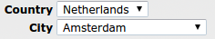
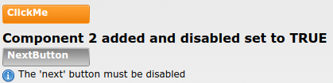

# Tests: data binding

## TestBindingOrder

Tests binding order: the country and city combo's depend on one another, and when country changes then city should change too. If binding order is bad then when country changes it sets city, but after that the binding to city would overwrite the earlier change. This test changes city and country and tests that the opposite control changes its value properly.

## TestBuildOrder

DomUI nodes are lazily built, meaning that the createContent call gets called while the page is rendered. Yoeri found the following issue with binding during delta rendering:

Component c1 adds component c2, and binds the nextbutton.disabled to c2's property "disabled".

When the tree gets rendered createContent for c1 gets called first, and the binding also executes at that point, getting "disabled" from c2 component that is not yet built.

If c2 changes the state of disabled in createContent then c1 has seen the wrong value. This test checks that binding executes after ALL builds are complete.
