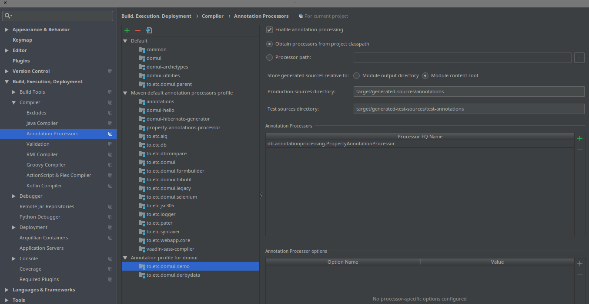
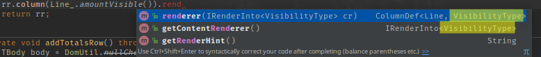

# Using typed properties: the property annotations processor

- [Summary](#summary)
- [Why typed properties?](#why-typed-properties)
- [Using typed properties in code](#using-typed-properties-in-code)
- [Enter the typed properties annotation processor.](#enter-the-typed-properties-annotation-processor)
  - [Extra configuration when using IntelliJ](#extra-configuration-when-using-intellij)
  - [Using the annotations processor with IntelliJ and Maven](#using-the-annotations-processor-with-intellij-and-maven)
- [How to generate properties for classes](#how-to-generate-properties-for-classes)
  - [What is generated](#what-is-generated)
- [Using typeful properties in code](#using-typeful-properties-in-code)

<a id="summary"></a>

# Summary

Typed Properties in DomUI are classes that are generated automatically, using an Annotations Processor, much like the [JPA Static Metamodel](https://www.thoughts-on-java.org/static-metamodel/) - but for *any* Java class that exposes getters and setters.

Once configured you can address properties in code not by a String, like "definition.code", but as a fully typed and compile-time checked path like Fact\_.definition().code(). You can create typed properties for any class, not just for database classes. And because the properties are fully typed the code using Typed Properties alsoknows what is the type of a property - allowing the compiler yet again to check more at compile time.

Most DomUI code that works/accepts properties accepts both the "old" String variants but also the typed properties. And [there is an IntelliJ Idea plugin](../using-the-domui-intellij-plugin/index.md) which automatically replaces String references to properties to the equivalent typed properties.

<a id="why-typed-properties"></a>

# Why typed properties?

One of the banes of Java is the abomination we call properties: the sad convention that gives us getters, setters and strings to access them. Using strings to access properties is a disaster because with one fell sweep all that work that the compiler does to check everything is useless: using a string means all errors will occur at runtime. And forget about refactoring: renaming properties is an exercise in frustration as even with the high level of support for refactoring in IDE's property references in strings will still bring your code down.

Languages like Kotlin do have properties and -more important- they have *property references*. These are typeful entities that are fully checked during compilation, and these are fully visible to the IDE too, so renames will work without issues. But all is not yet well: Kotlin property support still lacks some important things:

- Kotlin property references only work for classes made in Kotlin. A class defined in Java has no property references. This means that in this respect here is no interoperability at all: to use property references the classes used must be written in Kotlin.
- You can reference a single property but there is no nice way to reference a property path: something like Invoice::debtor::address::city or similar. This makes it hard to have path like structures. There are a few workarounds but most of them suck.

Since our Java "architects" are still busy with botching the things C# did well years ago we can probably forget about ever getting something reasonable, so we need a workaround.

Many frameworks have the above problem, so there are many solutions. The JPA 2.0 Criteria API has a specification for a domain class processor where an annotation processor is used to generate typed properties for all Entity classes in the JPA model. Libraries like queryDSL have a similar approach where a processor or a Maven plugin generates special classes for your entities, allowing you to write SQL in a reasonably intuitive and typesafe way. The problem with all of these is that they service a very specific area of the problem: they are defined for database entities. But any Java class that is part of a model can need typed properties, not just database related classes. So we need something more "generic".

<a id="using-typed-properties-in-code"></a>

# Using typed properties in code

In code you use typed properties at all locations where you would usually use  a string containing some property path. For example:

```
List<Album> query = dc().query(QCriteria.create(Album.class).eq(Album_.artist().name(), "AC/DC"));
System.out.println("Got " + query.size() + " results");
```

The stanza Album\_.artist().name() is a typed property reference. The Album\_ class is generated automatically by an annotations processor, for all classes annotated by either @GenerateProperties or @Entity. The result of a property reference is QField<I, V>, where I stands for the class that the property reference comes from (Album in the above case) and V stands for the type of the property itself (which would be String in the above example because the "name" property of the Artist class is of type String.

Another example is for instance in data binding:

```
ComboFixed2<AmountType> bedragTypeCombo = ComboFixed2.createEnumCombo(AmountType.class);
bedragTypeCombo.bind().to(row, Line_.amountType());
bedragTypeCombo.bind("readOnly").to(model(), LineController_.readOnly());
bedragTypeCombo.setMandatory(true);
bedragTypeCombo.immediate();
```

Here we bind the readOnly property of the control (still by string here) to the LineController.isReadOnly() method, and the value of the control to Line.amountType.

The annotator does not annotate controls because that would cause a lot of useless work. Instead all DomUI controls have typed properties inside the class itself for all control properties for which binding is a reasonable idea. So to fix the above string we need to change the line to:

```
bedragTypeCombo.bind(ComboFixed.READONLY).to(model(), LineController_.readOnly());
```

Finally, using typed properties makes it very easy to work with binding converters. These are used when the source of a binding has a different type from the target. Take the following example:

```
Text2<BigDecimal> ctrl = new Text2<>(BigDecimal.class);
ctrl.setConverter(new MoneyBigDecimalFullConverter());
ctrl.bind("readOnly").to(model(), LineController_.readOnly());
ctrl.bind(NodeBase.VISIBILITY).to(row, Line_.amountType(), amountType -> amountType == AmountType.Amount ? VisibilityType.VISIBLE : VisibilityType.HIDDEN);
```

The last line binds the CSS "visibility" property to the amountType property of the model, and ensures that the control is only visible when the amountType is Amount. We can use a lambda as above because the types of both from and to are known; had we used properties strings then we would have needed to write a complicated cast on the bind code.

<a id="enter-the-typed-properties-annotation-processor"></a>

# Enter the typed properties annotation processor.

Because having just one wheel is not that useful: let's invent yet another one. The DomUI property-annotations-processor is an annotation processor which will create special classes for each class that we use in a model. It generates *only* classes with typeful properties; it does not add "natural query" ability or whatever.

To use the annotations processor in Maven you need to add the annotations processor to your pom, and you need to add it to each project that has classes that you want to have typeful properties for. Add the following to the project's POM if you have a single project:

```
<build>
    <plugins>
        <plugin>
            <groupId>org.apache.maven.plugins</groupId>
            <artifactId>maven-compiler-plugin</artifactId>
            <version>${maven-compiler-plugin.version}</version>
            <configuration>
                <annotationProcessors>
                    <annotationProcessor>db.annotationprocessing.PropertyAnnotationProcessor</annotationProcessor>
                </annotationProcessors>
                <annotationProcessorPaths>
                    <dependency>
                        <groupId>to.etc.domui</groupId>
                        <artifactId>property-annotations-processor</artifactId>
                        <version>1.2-SNAPSHOT</version>
                    </dependency>
                </annotationProcessorPaths>
            </configuration>
        </plugin>
    </plugins>
</build>
```

This assumes that you already have a parent/upper POM which defines the rest of the maven-compiler-plugin's configuration.

If you have a project that consists of multiple modules then you should add the above configuration to the existing maven-compiler-plugin definition inside your parent/root POM, so that all projects get the configuration automatically. In such a case the config might also be present in a pluginManagement section.

You also need to use at least the following versions of the build plugins specified in your parent/top pom:

| Plugin | Version |     |
| --- | --- | --- |
| maven-compiler-plugin | 3.7.0 |     |
| plexus-compiler-eclipse | 2.8.4 | Only when you build your code in Maven using the Eclipse plugin, see [this stackoverflow article](https://stackoverflow.com/questions/33164976/using-eclipse-java-compiler-ecj-in-maven-builds/49599478#49599478) for details |

!w One warning: if you use the Eclipse compiler to compile your code in Maven then you need to make sure that you use at least version 2.8.4 of the plexus-compiler-eclipse plugin (to be released) because any version before that does not support annotation processors.

<a id="extra-configuration-when-using-intellij"></a>

### Extra configuration when using IntelliJ

IntelliJ does not really see the Annotations Processor as a "dependency" of the project. So if you are using DomUI as as submodule (so as source code) then IntelliJ will complain that the annotation processor could not be found. This is because no project "depends" on the annotation processor as far as IntelliJ is concerned - so it does not build it.

To fix this just add the annotation processor as a direct dependency of all of the modules that need the thing inside the project that needs it by adding the following fragment to the dependencies section:

```
                    <dependency>
                        <groupId>to.etc.domui</groupId>
                        <artifactId>property-annotations-processor</artifactId>
                        <version>1.2-SNAPSHOT</version>
                    </dependency>

```

<a id="using-the-annotations-processor-with-intellij-and-maven"></a>

## Using the annotations processor with IntelliJ and Maven

The above configuration is usually enough for IntelliJ to pick up what it needs to support annotation processing. But if you have trouble with the processor not being found or classes not being generated you can try to add the processor as a dependency to the projects that need it. This ensures that the processor is on the classpath when IntelliJ needs it. You should also check IntelliJ's annotation processor settings which can be found at:

Settings → Build, Execution, Deployment → Compiler → Annotation Processors

IntelliJ should be able to properly read the configuration from Maven's POMs but if not use the screen to properly define how it is to run the processors. An example (for DomUI's demo application) looks as follows:



With this configuration every build should rebuild any annotated classes where needed.

<a id="how-to-generate-properties-for-classes"></a>

# How to generate properties for classes

The annotation processor will by default generate typeful properties for all classes that:

- Are annotated with @javax.persistence.Entity
- Are annotated with @to.etc.annotations.GenerateProperties

The latter annotation can be found in the DomUI project:

```
<dependency>
  <groupId>to.etc</groupId>
  <artifactId>annotations</artifactId>
  <version>1.2-SNAPSHOT</version>
</dependency>
```

For any class annotated like this the processor will generate a set of classes that are used to make typeful properties and typeful property paths. All classes are generated in the special location where annotation processors generate code; when using Maven this is usually target/annotations/xxxx, where xxxx represents the same package that the original class has. So for a class to.etc.domui.derbydata.db.Artist the processor will generate the class to.etc.domui.derbydata.db.Artist\_ as the class holding the property references for the Artist class. This class-with-underscore is the only class that is directly used. There are more classes generated but these are used to be able to properly link classes and properties for paths.

<a id="what-is-generated"></a>

## What is generated

For each class that is annotated the generator will first detect all properties. It then depends on the *type* of the property whether it is generated:

- If the type is a simple type (all primitives and primitive wrappers, BigDecimal, BigInteger, String, all enums, java.util.Date) the property is always generated
- If the type is a class that is itself also annotated with either Entity or GenerateProperties then the property is generated.
- If the type is a Collection type where the contained type is annotated with Entity or GenerateProperties the property is generated.

These rules ensure that not the whole world gets generated as that would be a tad slow and useless.

To prevent a property from being generated you can add the @IgnoreGeneration annotation to its getter method. Do not add it to the field: modelwise properties **have** no fields, so adding things there is an abomination and causes yet another heap of horrible problems.

<a id="using-typeful-properties-in-code"></a>

# Using typeful properties in code

You should generate typed properties for *all* classes that have properties that are used in your code with either QCriteria queries or DomUI data binding. This means that at least the following classes should be generated:

- All Entity classes used by JPA/Hibernate
- All model classes used in (DomUI) views

!w The properties generator is a recent addition, and updating DomUI's code base to use them is a work in progress.

Typed properties can be used on every location where you would normally use a string containing a property path. For instance the following code:

```
private RowRenderer<Line> createRowRenderer() {
   RowRenderer<Line> rr = new RowRenderer<>(Line.class);
   rr.column().label("Period from").renderer(createMonthRenderer("from"));
   rr.column().label("Period till").renderer(createMonthRenderer("till"));
   rr.column("amountType").editable().factory(createAmountTypeControlFactory());
   rr.column("percentage").editable().factory(createPercentageControlFactory());
   rr.column("amount").editable().factory(createAmountControlFactory());
   rr.column().label("Divide").renderer(createDivideRenderer());
   if(!model().isReadOnly()) {
      rr.column().renderer(createRemoveRenderer()).width("1%").nowrap();
   }
   return rr;
}
```

uses strings as property names. It is easily replaced by the equivalent code with typed properties:

```
private RowRenderer<Line> createRowRenderer() {
   RowRenderer<Line> rr = new RowRenderer<>(Line.class);
   rr.column().label("Period from").renderer(createMonthRenderer(Line_.from()));
   rr.column().label("Period till").renderer(createMonthRenderer(Line_.till()));
   rr.column(Line_.amountType()).editable().factory(createAmountTypeControlFactory());
   rr.column(Line_.percentage()).editable().factory(createPercentageControlFactory());
   rr.column(Line_.amount()).editable().factory(createAmountControlFactory());
   rr.column().label("Divide").renderer(createDivideRenderer());
   if(!model().isReadOnly()) {
      rr.column().renderer(createRemoveRenderer()).width("1%").nowrap();
   }
   return rr;
}
```

The advantages are plenty: since the properties are typed all parts of the RowRenderer are now typeful. So for instance adding a renderer now shows the proper type instead of ?:



This is invaluable in for instance bindings with conversion, where it is important to be able to know what is converted to what else:

TBD

It is also very useful for refactoring: the moment either the type or the name of a property changes the compiler will immediately signal problems. It is also easy to do impact analysis: just search for occurrences of a property method to see what code would be impacted by a change.
